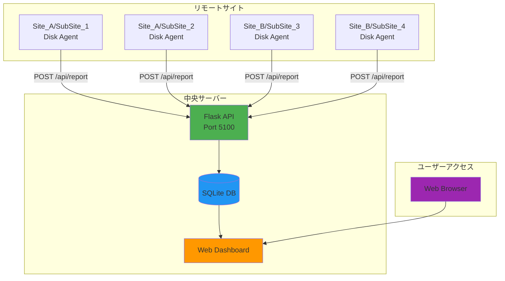

<div align="center">

  <samp>Simple. Powerful. Dashboard.</samp>
  <br><br>
  <a href="https://github.com/mile-chang/logHive">
    
  </a>
</div>

> リアルタイムの可視化と自動化されたデータ収集機能を備えた、複数サイトのディスク使用量を追跡するための集中監視システム。

[](https://github.com/mile-chang/logHive/actions/workflows/ci.yml)
[](https://opensource.org/licenses/MIT)
[](https://www.python.org/downloads/)
[](https://flask.palletsprojects.com/)

[English](README.md) | [繁體中文](README.zh-TW.md)

---

## 概要

logHive は、複数のサイトにわたるディスク使用量を追跡および可視化するために設計された監視システムです。Flask で構築され、レスポンシブなウェブインターフェースを備えており、リアルタイム監視、履歴追跡、および軽量エージェントによる自動データ収集を提供します。

## 機能デモ


*完全なウォークスルー：ログイン → データ読み込み（アニメーション付き） → インタラクティブダッシュボード*

## 主な機能

- **モダンなダークテーマ** - 背景のぼかし効果を備えた洗練されたグラスモーフィズムデザイン
- **リアルタイム監視** - 自動更新によるライブディスク使用量追跡
- **インタラクティブなチャート** - D3.js を使用した履歴使用量の可視化
- **マルチサイトサポート** - カスタマイズ可能な設定で無制限のサイトを管理
- **履歴分析** - 月次の増加追跡と使用統計
- **自動化エージェント** - 軽量 Bash スクリプト + Docker コンテナ化
- **モニタリングスタック** - Prometheus メトリクス + Grafana ダッシュボード + Node Exporter
- **CI パイプライン** - GitHub Actions + ShellCheck & Docker Build 検証

## システムアーキテクチャ



## クイックスタート

### 前提条件

- Python 3.8+ / Git
- Docker & Docker Compose（コンテナ化デプロイ）

### ローカル開発

```bash
# クローンと設定
git clone https://github.com/mile-chang/logHive.git
cd logHive
cp .env.example .env
nano .env  # SECRET_KEY、API_TOKEN、パスワードを設定

# インストールと実行
python3 -m venv venv
source venv/bin/activate
pip install -r requirements.txt
python app.py
# → http://localhost:5100
```

### Docker デプロイ（2台 EC2）

完全な **[デプロイガイド](docs/deployment.ja.md)**（[English](docs/deployment.md) | [繁體中文](docs/deployment.zh-TW.md)）を参照：

- EC2 #1 セットアップ（LogHive + Prometheus + Grafana）
- EC2 #2 セットアップ（6 エージェントコンテナ + Node Exporter）
- Security Group 設定
- デモモードとクリーンアップコマンド
- トラブルシューティング

## API エンドポイント

| メソッド | エンドポイント | 認証 | 説明 |
|---------|---------------|------|------|
| POST | `/api/report` | API Token | エージェントからのディスク使用量を受信 |
| GET | `/api/summary` | Session | 全サイトの概要 |
| GET | `/api/sites` | Session | サイト設定 |
| GET | `/api/history/<site>/<sub_site>/<server_type>` | Session | 履歴データ |
| GET | `/api/monthly/<site>/<sub_site>/<server_type>` | Session | 月次統計 |
| GET | `/metrics` | なし | Prometheus メトリクス |

> [!WARNING]
> `/metrics` エンドポイントには認証がありません。本番環境ではポート 5100 を信頼できるソースのみに制限してください。

## プロジェクト構造

```
logHive/
├── app.py                        # メイン Flask アプリケーション
├── config.py                     # 設定とサイト定義
├── models.py                     # データベースモデルとクエリ
├── requirements.txt              # Python 依存関係
├── .env.example                  # 環境変数テンプレート
├── gunicorn_config.py            # 本番 WSGI サーバー設定
├── docker-entrypoint.sh          # コンテナエントリポイントスクリプト
├── Dockerfile                    # LogHive コンテナイメージ
├── docker-compose.yml            # EC2 #1: LogHive + モニタリングスタック
├── docker-compose.agent.yml      # EC2 #2: エージェントコンテナ
├── agent/                        # エージェントスクリプトとコンテナ
│   ├── disk_agent.sh             # 標準エージェント（環境変数設定）
│   ├── disk_agent_v2.sh          # SSH トンネルバージョン
│   ├── file_generator.sh         # ランダムファイル生成器（デモ用）
│   ├── entrypoint.sh             # エージェントコンテナエントリポイント
│   ├── Dockerfile                # エージェントコンテナイメージ
│   ├── demo_generate.sh          # ワンクリックデモトリガー
│   ├── clean_agent_data.sh       # データクリーンアップ
│   └── cron_setup.md             # cron 設定ガイド
├── monitoring/                   # Prometheus & Grafana 設定
│   ├── prometheus.yml            # Prometheus スクレイプ設定
│   └── grafana/
│       ├── provisioning/         # 自動プロビジョニング設定
│       │   ├── datasources/datasource.yml
│       │   └── dashboards/dashboard.yml
│       └── dashboards/
│           └── loghive-dashboard.json
├── static/                       # フロントエンドアセット
│   ├── css/
│   │   ├── style.css             # メインスタイルシート
│   │   ├── sidebar.css           # サイドバーコンポーネントスタイル
│   │   └── toppanel.css          # トップパネルスタイル
│   ├── js/
│   │   └── dashboard.js          # ダッシュボードロジック (D3.js チャート)
│   ├── favicon.svg               # ブラウザファビコン
│   └── logo_full.svg             # LogHive ロゴ
├── templates/                    # Jinja2 HTML テンプレート
│   ├── dashboard.html            # メインダッシュボードページ
│   └── login.html                # ログインページ
├── tools/                        # メンテナンスユーティリティ
│   ├── clean_db.py               # データベースクリーンアップ
│   ├── migrate_db.py             # データベースマイグレーション
│   └── update_passwords.py       # パスワード更新ツール
├── deploy/                       # サーバーデプロイスクリプト
│   ├── start.sh                  # アプリケーション起動
│   ├── stop.sh                   # アプリケーション停止
│   ├── restart.sh                # アプリケーション再起動
│   └── setup_ssh_security.sh     # SSH セキュリティ強化
├── docs/                         # ドキュメント
│   ├── deployment.md             # Full deployment guide (EN)
│   ├── deployment.zh-TW.md       # 完整部署指南 (繁中)
│   ├── deployment.ja.md          # 完全デプロイガイド (日本語)
│   └── screenshots/
│       └── demo.webp             # 機能デモアニメーション
├── data/                         # SQLite データベース（gitignored）
└── logs/                         # アプリケーションログ（gitignored）
```

## 技術スタック

| レイヤー | 技術 |
|----------|------|
| バックエンド | Flask, SQLite, Gunicorn, Prometheus Instrumentator |
| フロントエンド | Vanilla JS, D3.js, Responsive CSS |
| モニタリング | Prometheus, Grafana, Node Exporter |
| DevOps | Docker, GitHub Actions, ShellCheck |

## セキュリティ

- 環境ベースのシークレット管理（`.env`、ハードコードなし）
- エージェントの API トークン認証
- Werkzeug によるパスワードハッシュ化
- セッションベースのウェブ認証
- テスト/本番データベースの分離
- 制限されたネットワーク向けの SSH トンネルサポート
- `/metrics` は内部アクセスのみに制限すべき

## ライセンス

本プロジェクトは MIT ライセンスの下でライセンスされています - 詳細については [LICENSE](LICENSE) ファイルを参照してください。
