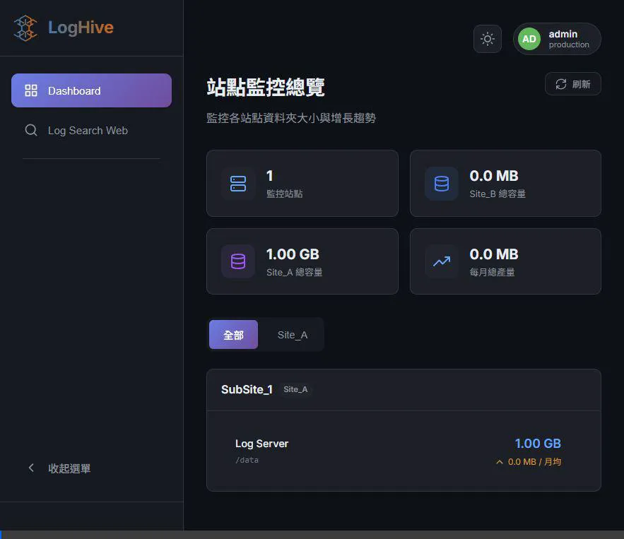
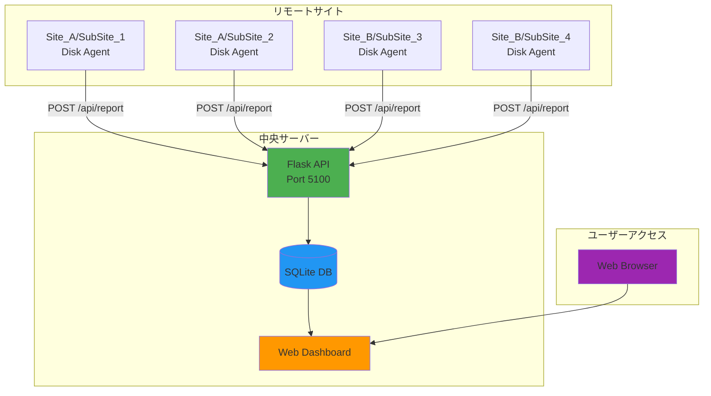
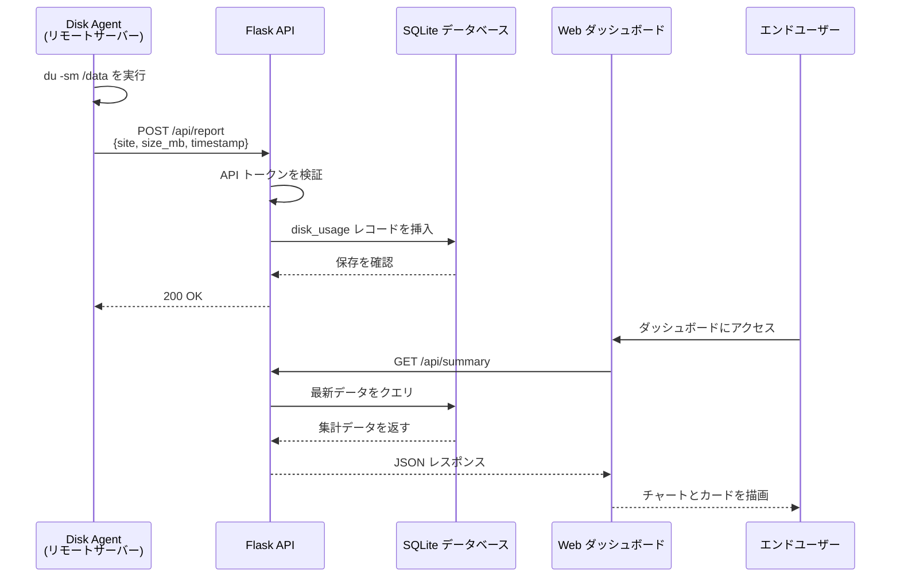

<div align="center">

  <samp>Simple. Powerful. Dashboard.</samp>
  <br><br>
  <a href="https://github.com/mile-chang/logHive">
    
  </a>
</div>

> リアルタイムの可視化と自動化されたデータ収集機能を備えた、複数サイトのディスク使用量を追跡するための集中監視システム。

[](https://opensource.org/licenses/MIT)
[](https://www.python.org/downloads/)
[](https://flask.palletsprojects.com/)

[English](README.md) | [繁體中文](README.zh-TW.md)

---

### 概要

logHive は、複数のサイトにわたるディスク使用量を追跡および可視化するために設計された監視システムです。Flask で構築され、レスポンシブなウェブインターフェースを備えており、リアルタイム監視、履歴追跡、および軽量エージェントによる自動データ収集を提供します。


### 機能デモ



*完全なウォークスルー：ログイン → データ読み込み（アニメーション付き） → インタラクティブダッシュボード*

### 主な機能

- **モダンなダークテーマ** - 背景のぼかし効果を備えた洗練されたグラスモーフィズムデザイン
- **リアルタイム監視** - 自動更新によるライブディスク使用量追跡
- **インタラクティブなチャート** - Chart.js を使用した履歴使用量の可視化
- **トースト通知** - スムーズなアニメーションを備えたエレガントな通知
- **読み込み状態** - すべての非同期操作に対する視覚的フィードバック
- **マルチサイトサポート** - カスタマイズ可能な設定で無制限のサイトを管理
- **履歴分析** - 月次の増加追跡と使用統計
- **デュアル環境** - テスト用と本番用のデータベースを分離
- **自動化エージェント** - データ収集用の軽量 Bash スクリプト
- **SSH トンネルサポート** - 制限されたネットワーク向けの安全なデータ転送
- **本番環境対応** - Systemd 統合、Gunicorn、包括的なログ記録

### システムアーキテクチャ



### データフロー



### クイックスタート

#### 前提条件

- Python 3.8 以上
- Git
- 仮想環境（推奨）

#### インストール

```bash
# 1. リポジトリをクローン
git clone https://github.com/YOUR_USERNAME/logHive.git
cd logHive

# 2. 環境設定
cp .env.example .env
nano .env  # 編集して安全なキーを追加

# セキュアなキーを生成
python3 <<EOF
import secrets
print("SECRET_KEY=" + secrets.token_hex(32))
print("API_TOKEN=" + secrets.token_urlsafe(32))
EOF

# 3. 依存関係のインストール
python3 -m venv venv
source venv/bin/activate  # Windows: venv\Scripts\activate
pip install -r requirements.txt

# 4. データベースの初期化
python -c "from models import init_db; init_db()"

# 5. サーバーの起動
python app.py
```

ダッシュボードは `http://localhost:5100` で利用可能になります。

#### サイト設定 (`config.py`)

```python
SITES_CONFIG = {
    "Site_A": {
        "sub_sites": {
            "SubSite_1": {
                "log_server": {"name": "Log Server"},
                "backup_server": {"name": "Backup Server"}
            }
        }
    }
}
```

#### エージェントのデプロイ

監視対象のサーバーにエージェントをデプロイします：

```bash
# 1. エージェントをリモートサーバーにコピー
scp agent/disk_agent.sh user@remote-server:/opt/disk-agent/

# 2. エージェントの設定
nano /opt/disk-agent/disk_agent.sh

# 以下の変数を設定：
CENTRAL_SERVER_URL="http://your-server:5100/api/report"
API_TOKEN="your-api-token-from-.env"
SITE="Site_A"
SUB_SITE="SubSite_1"
SERVER_TYPE="log_server"

# 3. cron でスケジュール設定（毎時）
crontab -e
# 以下の行を追加：
0 * * * * /opt/disk-agent/disk_agent.sh >> /var/log/disk-agent.log 2>&1
```

### API エンドポイント

#### データ収集
```http
POST /api/report
Content-Type: application/json

{
  "token": "your-api-token",
  "site": "Site_A",
  "sub_site": "SubSite_1",
  "server_type": "log_server",
  "path": "/data",
  "size_mb": 1024.5
}
```

#### ダッシュボードクエリ
- `GET /api/summary` - 全サイトのサマリー
- `GET /api/sites` - 全サイトのリスト
- `GET /api/history/<site>/<sub_site>/<server_type>` - 履歴データ
- `GET /api/monthly/<site>/<sub_site>/<server_type>` - 月次統計

### プロジェクト構造

```
logHive/
├── app.py                 # メイン Flask アプリケーション
├── config.py              # 設定とサイト定義
├── models.py              # データベースモデルとクエリ
├── requirements.txt       # Python 依存関係
├── .env.example          # 環境変数テンプレート
├── gunicorn_config.py     # 本番サーバー設定
├── agent/                # リモートデータ収集エージェント
│   ├── disk_agent.sh     # 標準エージェントスクリプト
│   ├── disk_agent_v2.sh  # SSH トンネルバージョン
│   └── cron_setup.md     # cron 設定ガイド
├── static/               # フロントエンドアセット
│   ├── css/              # スタイルシート
│   │   ├── style.css     # メインスタイル
│   │   ├── sidebar.css   # サイドバーコンポーネント
│   │   ├── toppanel.css  # トップナビゲーション
│   └── js/               # JavaScript ファイル
│       └── dashboard.js  # ダッシュボードロジック
├── templates/            # Jinja2 テンプレート
│   ├── dashboard.html    # メインダッシュボード
│   └── login.html        # ログインページ
├── data/                 # SQLite データベース（gitignored）
└── logs/                 # アプリケーションログ（gitignored）
```

### セキュリティ機能

- 環境ベースのシークレット管理（パスワードのハードコードなし）
- エージェントの API トークン認証
- werkzeug security によるパスワードハッシュ化
- セッションベースの認証
- テスト/本番データベースの分離
- 制限されたネットワーク向けの SSH トンネルサポート
- 機密データに対する包括的な `.gitignore`

### 本番環境へのデプロイ

#### Systemd の使用 (Linux)
```bash
# 1. サービスファイルの作成: /etc/systemd/system/dashboard.service
[Unit]
Description=Log Hive
After=network.target

[Service]
Type=notify
User=appuser
WorkingDirectory=/opt/dashboard
ExecStart=/opt/dashboard/start.sh
Environment="ENVIRONMENT=production"
Restart=always

[Install]
WantedBy=multi-user.target

# 2. 有効化と起動
sudo systemctl daemon-reload
sudo systemctl enable dashboard
sudo systemctl start dashboard
sudo systemctl status dashboard
```

#### Gunicorn の直接使用
```bash
# 依存関係のインストール
pip install -r requirements.txt

# Gunicorn で実行
gunicorn -c gunicorn_config.py app:app
```

### 技術スタック

**バックエンド:**
- Flask 2.0+ - Web フレームワーク
- SQLite - データベース
- Gunicorn - WSGI サーバー
- APScheduler - バックグラウンドタスク

**フロントエンド:**
- Vanilla JavaScript - 重いフレームワークなし
- D3.js - データ可視化
- Responsive CSS - モバイルフレンドリー

**DevOps:**
- Systemd - サービス管理
- Bash - エージェントスクリプト
- Git - バージョン管理

### 開発

```bash
# 開発モードで実行
export ENVIRONMENT=test
python app.py

# テストデータの読み込み
# ログイン ユーザー名: test, パスワード: test123

# デバッグモードで実行
export FLASK_DEBUG=1
python app.py
```
### ライセンス

本プロジェクトは MIT ライセンスの下でライセンスされています - 詳細については [LICENSE](LICENSE) ファイルを参照してください。

### プロジェクトについて

このプロジェクトは、以下を実証するフルスタック監視ソリューションとして開発されました：
- システムアーキテクチャ設計
- RESTful API 開発
- 自動化されたインフラストラクチャ監視
- 本番環境へのデプロイプラクティス
- セキュリティのベストプラクティス
- ドキュメンテーションと保守性
