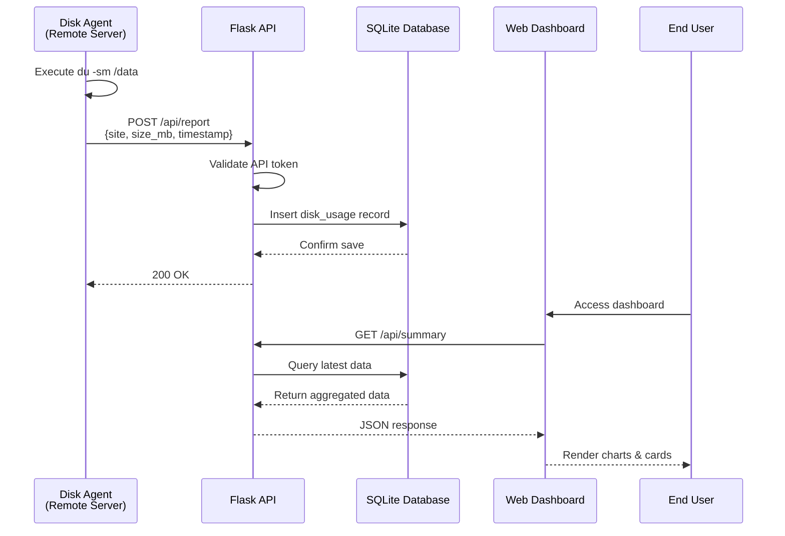
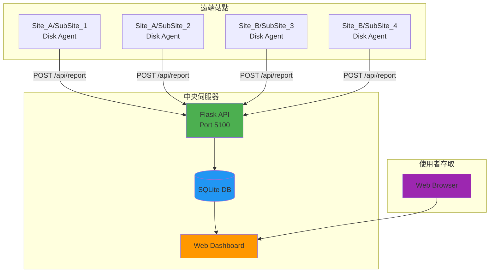

<p align="center">
  <br>
  <samp>Simple. Powerful. Dashboard.</samp>
  <br><br>
  
  <span style="font-size: 80px; font-weight: bold; color: #206dce; vertical-align: middle; font-family: sans-serif; margin-left: 10px;">LogHive</span>
</p>

> A centralized monitoring system for tracking disk usage across multiple sites with real-time visualization and automated data collection.

[](https://opensource.org/licenses/MIT)
[](https://www.python.org/downloads/)
[](https://flask.palletsprojects.com/)

[English](#english) | [中文](#chinese)

---

## English

### Overview

logHive is a production-ready monitoring system designed to track and visualize disk usage across multiple sites. Built with Flask and featuring a responsive web interface, it provides real-time monitoring, historical tracking, and automated data collection through lightweight agents.


### Feature Demo


*Complete walkthrough: Login → Data Loading (with animation) → Interactive Dashboard*

### Key Features

- **Modern Dark Theme** - Sleek glassmorphism design with backdrop blur effects
- **Real-time Monitoring** - Live disk usage tracking with auto-refresh
- **Interactive Charts** - Historical usage visualization using Chart.js
- **Toast Notifications** - Elegant notifications with smooth animations
- **Loading States** - Visual feedback for all async operations
- **Multi-site Support** - Manage unlimited sites with customizable configurations
- **Historical Analytics** - Monthly growth tracking and usage statistics
- **Dual Environments** - Separate test and production databases
- **Automated Agents** - Lightweight bash scripts for data collection
- **SSH Tunnel Support** - Secure data transmission for restricted networks
- **Production Ready** - Systemd integration, Gunicorn, and comprehensive logging


> **Note:** Replace the placeholder images below with actual screenshots from your deployment. See [docs/screenshots/](docs/screenshots/) for examples.

### System Architecture


### Data Flow



### Quick Start

#### Prerequisites

- Python 3.8 or higher
- Git
- Virtual environment (recommended)

#### Installation

```bash
# 1. Clone the repository
git clone https://github.com/YOUR_USERNAME/logHive.git
cd logHive

# 2. Set up environment
cp .env.example .env
nano .env  # Edit and add your secure keys

# Generate secure keys
python3 <<EOF
import secrets
print("SECRET_KEY=" + secrets.token_hex(32))
print("API_TOKEN=" + secrets.token_urlsafe(32))
EOF

# 3. Install dependencies
python3 -m venv venv
source venv/bin/activate  # Windows: venv\Scripts\activate
pip install -r requirements.txt

# 4. Initialize database
python -c "from models import init_db; init_db()"

# 5. Start the server
python app.py
```

The dashboard will be available at `http://localhost:5100`

### Screenshots

**Dashboard Overview**
- Real-time disk usage cards with color-coded status
- Interactive charts showing historical trends
- Site filtering and search functionality
- Monthly growth statistics

**Features:**
- Dark mode support
- D3.js powered visualizations
- Log search with date range filtering
- Download logs directly from dashboard

### Configuration

#### Site Configuration (`config.py`)

```python
SITES_CONFIG = {
    "Site_A": {
        "sub_sites": {
            "SubSite_1": {
                "log_server": {"name": "Log Server"},
                "backup_server": {"name": "Backup Server"}
            }
        }
    }
}
```

#### Agent Deployment

Deploy agents to monitored servers:

```bash
# 1. Copy agent to remote server
scp agent/disk_agent.sh user@remote-server:/opt/disk-agent/

# 2. Configure the agent
nano /opt/disk-agent/disk_agent.sh

# Set these variables:
CENTRAL_SERVER_URL="http://your-server:5100/api/report"
API_TOKEN="your-api-token-from-.env"
SITE="Site_A"
SUB_SITE="SubSite_1"
SERVER_TYPE="log_server"

# 3. Schedule with cron (hourly)
crontab -e
# Add this line:
0 * * * * /opt/disk-agent/disk_agent.sh >> /var/log/disk-agent.log 2>&1
```

### API Endpoints

#### Data Collection
```http
POST /api/report
Content-Type: application/json

{
  "token": "your-api-token",
  "site": "Site_A",
  "sub_site": "SubSite_1",
  "server_type": "log_server",
  "path": "/data",
  "size_mb": 1024.5
}
```

#### Dashboard Queries
- `GET /api/summary` - All sites summary
- `GET /api/sites` - List all sites
- `GET /api/history/<site>/<sub_site>/<server_type>` - Historical data
- `GET /api/monthly/<site>/<sub_site>/<server_type>` - Monthly statistics

### Project Structure

```
logHive/
├── app.py                 # Main Flask application
├── config.py              # Configuration and site definitions
├── models.py              # Database models and queries
├── requirements.txt       # Python dependencies
├── .env.example          # Environment variables template
├── agent/                # Remote data collection agents
│   ├── disk_agent.sh     # Standard agent script
│   ├── disk_agent_v2.sh  # SSH tunnel version
│   └── cron_setup.md     # Cron configuration guide
├── static/               # Frontend assets
│   ├── css/style.css     # Responsive stylesheets
│   ├── js/dashboard.js   # Dashboard logic
│   └── js/logs.js        # Log search functionality
├── templates/            # Jinja2 templates
│   ├── dashboard.html    # Main dashboard
│   └── logs.html         # Log search interface
├── data/                 # SQLite databases (gitignored)
└── logs/                 # Application logs (gitignored)
```

### Security Features

- Environment-based secrets (no hardcoded passwords)
- API token authentication for agents
- Password hashing with werkzeug security
- Session-based authentication
- Separate test/production databases
- SSH tunnel support for restricted networks
- Comprehensive `.gitignore` for sensitive data

### Production Deployment

#### Using Systemd (Linux)
```bash
# 1. Create service file: /etc/systemd/system/dashboard.service
[Unit]
Description=Log Hive
After=network.target

[Service]
Type=notify
User=appuser
WorkingDirectory=/opt/dashboard
ExecStart=/opt/dashboard/start.sh
Environment="ENVIRONMENT=production"
Restart=always

[Install]
WantedBy=multi-user.target

# 2. Enable and start
sudo systemctl daemon-reload
sudo systemctl enable dashboard
sudo systemctl start dashboard
sudo systemctl status dashboard
```

#### Using Gunicorn Directly
```bash
# Install dependencies
pip install -r requirements.txt

# Run with Gunicorn
gunicorn -c gunicorn_config.py app:app
```

### Tech Stack

**Backend:**
- Flask 2.0+ - Web framework
- SQLite - Database
- Gunicorn - WSGI server
- APScheduler - Background tasks

**Frontend:**
- Vanilla JavaScript - No heavy frameworks
- D3.js - Data visualization
- Responsive CSS - Mobile-friendly

**DevOps:**
- Systemd - Service management
- Bash - Agent scripts
- Git - Version control

### Development

```bash
# Run in development mode
export ENVIRONMENT=test
python app.py

# Load test data
# Login with username: test, password: test123

# Run with debug mode
export FLASK_DEBUG=1
python app.py
```


### License

This project is licensed under the MIT License - see the [LICENSE](LICENSE) file for details.


### About

This project was developed as a full-stack monitoring solution demonstrating:
- System architecture design
- RESTful API development
- Automated infrastructure monitoring
- Production deployment practices
- Security best practices
- Documentation and maintainability


### Contact

Questions or feedback? Feel free to reach out!

---

## Chinese

### 概述

logHive 是一個已實戰部署的監控系統，專為追蹤多個站點的磁碟使用情況而設計。採用 Flask 構建，配備響應式網頁介面，提供即時監控、歷史追蹤和自動化資料收集功能。


### 主要特色

- **即時監控** - 即時硬碟使用追蹤，自動更新
- **多站點支援** - 管理無限站點，可自訂配置
- **歷史分析** - 每月增長追蹤和使用統計
- **雙環境** - 分離測試和生產資料庫
- **自動化 Agent** - 輕量級 bash 腳本進行資料收集
- **響應式 UI** - 現代化儀表板，支援深色模式
- **SSH Tunnel 支援** - 適用於受限網路的安全資料傳輸
- **生產就緒** - Systemd 整合、Gunicorn 和完整日誌記錄

### 系統架構



### 快速開始

#### 前置需求

- Python 3.8 或更高版本
- Git
- 虛擬環境（推薦）

#### 安裝步驟

```bash
# 1. Clone 倉庫
git clone https://github.com/YOUR_USERNAME/logHive.git
cd logHive

# 2. 設定環境
cp .env.example .env
nano .env  # 編輯並添加您的安全金鑰

# 生成安全金鑰
python3 <<EOF
import secrets
print("SECRET_KEY=" + secrets.token_hex(32))
print("API_TOKEN=" + secrets.token_urlsafe(32))
EOF

# 3. 安裝依賴
python3 -m venv venv
source venv/bin/activate  # Windows: venv\Scripts\activate
pip install -r requirements.txt

# 4. 初始化資料庫
python -c "from models import init_db; init_db()"

# 5. 啟動伺服器
python app.py
```

儀表板將在 `http://localhost:5100` 可用

### 配置

#### 站點配置 (`config.py`)

```python
SITES_CONFIG = {
    "Site_A": {
        "sub_sites": {
            "SubSite_1": {
                "log_server": {"name": "Log Server"},
                "backup_server": {"name": "Backup Server"}
            }
        }
    }
}
```

### 技術堆疊

**後端：**
- Flask 2.0+ - Web 框架
- SQLite - 資料庫
- Gunicorn - WSGI 伺服器
- APScheduler - 背景任務

**前端：**
- Vanilla JavaScript - 無重型框架
- D3.js - 資料視覺化
- Responsive CSS - 移動裝置友好

**DevOps：**
- Systemd - 服務管理
- Bash - Agent 腳本
- Git - 版本控制

### 關於

此專案作為全端監控解決方案開發，展示：
- 系統架構設計
- RESTful API 開發
- 自動化基礎設施監控
- 生產環境部署實踐
- 安全最佳實踐
- 文檔和可維護性


---

**⚠️ Note**: This is a sanitized version for public release. To use in your environment, update `config.py` with your actual site configurations.
