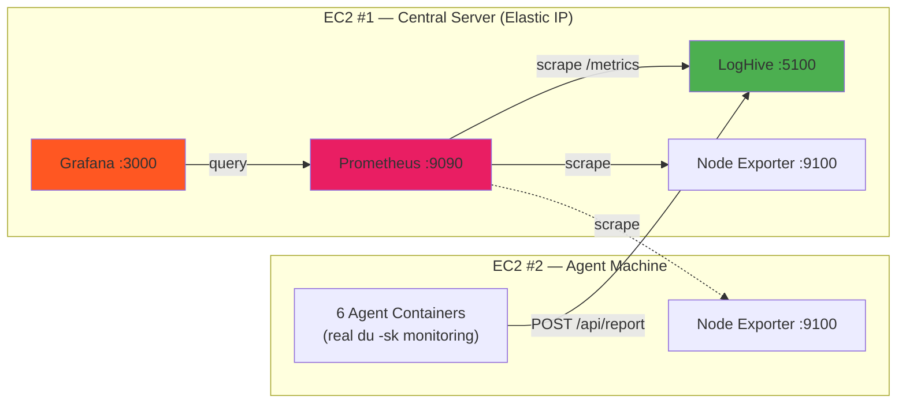

<div align="center">

  <samp>Simple. Powerful. Dashboard.</samp>
  <br><br>
  <a href="https://github.com/mile-chang/logHive">
    
  </a>
</div>

> A centralized monitoring system for tracking disk usage across multiple sites with real-time visualization and automated data collection.

[](https://github.com/mile-chang/logHive/actions/workflows/ci.yml)
[](https://opensource.org/licenses/MIT)
[](https://www.python.org/downloads/)
[](https://flask.palletsprojects.com/)

[繁體中文](README.zh-TW.md) | [日本語](README.ja.md)

---

## Overview

logHive is a monitoring system designed to track and visualize disk usage across multiple sites. Built with Flask and featuring a responsive web interface, it provides real-time monitoring, historical tracking, and automated data collection through lightweight agents.

## Feature Demo


*Complete walkthrough: Login → Data Loading (with animation) → Interactive Dashboard*

## Key Features

- **Modern Dark Theme** - Sleek glassmorphism design with backdrop blur effects
- **Real-time Monitoring** - Live disk usage tracking with auto-refresh
- **Interactive Charts** - Historical usage visualization with D3.js
- **Multi-site Support** - Manage unlimited sites with customizable configurations
- **Historical Analytics** - Monthly growth tracking and usage statistics
- **Automated Agents** - Lightweight bash scripts with Docker containerization
- **Monitoring Stack** - Prometheus metrics + Grafana dashboards + Node Exporter
- **CI Pipeline** - GitHub Actions with ShellCheck and Docker Build validation

## System Architecture



## Quick Start

### Prerequisites

- Python 3.8+ / Git
- Docker & Docker Compose (for containerized deployment)

### Local Development

```bash
# Clone and configure
git clone https://github.com/mile-chang/logHive.git
cd logHive
cp .env.example .env
nano .env  # Set SECRET_KEY, API_TOKEN, passwords

# Install and run
python3 -m venv venv
source venv/bin/activate
pip install -r requirements.txt
python app.py
# → http://localhost:5100
```

### Docker Deployment (Two-EC2)

See the full **[Deployment Guide](docs/deployment.md)** ([繁體中文](docs/deployment.zh-TW.md)) for:

- EC2 #1 setup (LogHive + Prometheus + Grafana)
- EC2 #2 setup (6 Agent containers + Node Exporter)
- Security Group configuration
- Demo mode and cleanup commands
- Troubleshooting

## API Endpoints

| Method | Endpoint | Auth | Description |
|--------|----------|------|-------------|
| POST | `/api/report` | API Token | Receive disk usage from agents |
| GET | `/api/summary` | Session | All sites overview |
| GET | `/api/sites` | Session | Site configuration |
| GET | `/api/history/<site>/<sub_site>/<server_type>` | Session | Historical data |
| GET | `/api/monthly/<site>/<sub_site>/<server_type>` | Session | Monthly statistics |
| GET | `/metrics` | None | Prometheus metrics |

> [!WARNING]
> `/metrics` endpoint has no authentication. Ensure port 5100 is only accessible from trusted sources in production.

## Project Structure

```
logHive/
├── app.py                        # Main Flask application
├── config.py                     # Configuration and site definitions
├── models.py                     # Database models and queries
├── requirements.txt              # Python dependencies
├── .env.example                  # Environment variables template
├── gunicorn_config.py            # Production WSGI server config
├── docker-entrypoint.sh          # Container entrypoint script
├── Dockerfile                    # LogHive container image
├── docker-compose.yml            # EC2 #1: LogHive + Monitoring stack
├── docker-compose.agent.yml      # EC2 #2: Agent containers
├── agent/                        # Agent scripts and container
│   ├── disk_agent.sh             # Standard agent (env var configurable)
│   ├── disk_agent_v2.sh          # SSH tunnel version
│   ├── file_generator.sh         # Random file generator for demo
│   ├── entrypoint.sh             # Agent container entrypoint
│   ├── Dockerfile                # Agent container image
│   ├── demo_generate.sh          # One-click demo trigger
│   ├── clean_agent_data.sh       # Data cleanup
│   └── cron_setup.md             # Cron configuration guide
├── monitoring/                   # Prometheus & Grafana configs
│   ├── prometheus.yml            # Prometheus scrape config
│   └── grafana/
│       ├── provisioning/         # Auto-provision configs
│       │   ├── datasources/datasource.yml
│       │   └── dashboards/dashboard.yml
│       └── dashboards/
│           └── loghive-dashboard.json
├── static/                       # Frontend assets
│   ├── css/
│   │   ├── style.css             # Main stylesheet
│   │   ├── sidebar.css           # Sidebar component styles
│   │   └── toppanel.css          # Top panel styles
│   ├── js/
│   │   └── dashboard.js          # Dashboard logic (D3.js charts)
│   ├── favicon.svg               # Browser favicon
│   └── logo_full.svg             # LogHive logo
├── templates/                    # Jinja2 HTML templates
│   ├── dashboard.html            # Main dashboard page
│   └── login.html                # Login page
├── tools/                        # Maintenance utilities
│   ├── clean_db.py               # Database cleanup
│   ├── migrate_db.py             # Database migration
│   └── update_passwords.py       # Password update tool
├── deploy/                       # Server deployment scripts
│   ├── start.sh                  # Start application
│   ├── stop.sh                   # Stop application
│   ├── restart.sh                # Restart application
│   └── setup_ssh_security.sh     # SSH security hardening
├── docs/                         # Documentation
│   ├── deployment.md             # Full deployment guide (EN)
│   ├── deployment.zh-TW.md       # 完整部署指南 (繁中)
│   └── screenshots/
│       └── demo.webp             # Feature demo animation
├── data/                         # SQLite databases (gitignored)
└── logs/                         # Application logs (gitignored)
```

## Tech Stack

| Layer | Technology |
|-------|-----------|
| Backend | Flask, SQLite, Gunicorn, Prometheus Instrumentator |
| Frontend | Vanilla JS, D3.js, Responsive CSS |
| Monitoring | Prometheus, Grafana, Node Exporter |
| DevOps | Docker, GitHub Actions, ShellCheck |

## Security

- Environment-based secrets (`.env`, never hardcoded)
- API token authentication for agents
- Password hashing with Werkzeug
- Session-based web authentication
- Separate test/production databases
- SSH tunnel support for restricted networks
- `/metrics` should be restricted to internal access only

## License

This project is licensed under the MIT License - see the [LICENSE](LICENSE) file for details.
