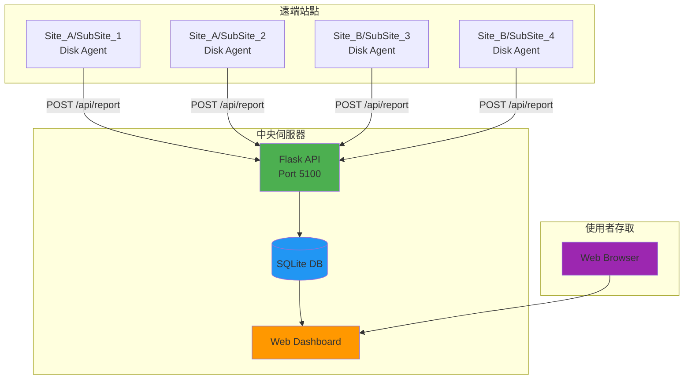
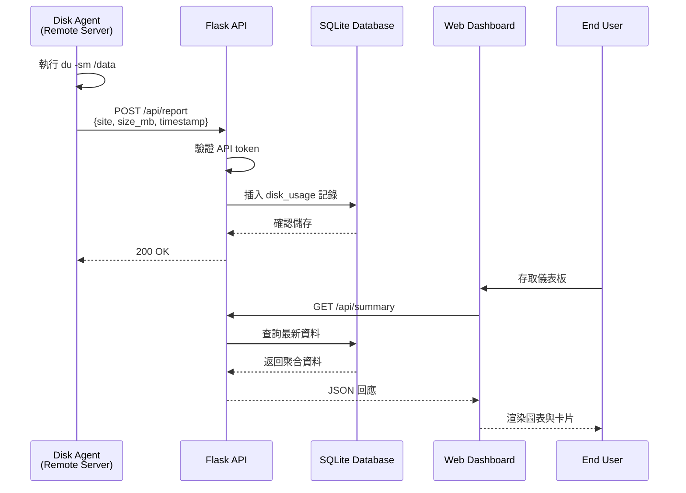

<div align="center">

  <samp>Simple. Powerful. Dashboard.</samp>
  <br><br>
  <a href="https://github.com/mile-chang/logHive">
    
  </a>
</div>

> 一個集中式監控系統，專為追蹤多個站點的硬碟使用情況而設計，提供即時視覺化和自動化資料收集功能。

[](https://opensource.org/licenses/MIT)
[](https://www.python.org/downloads/)
[](https://flask.palletsprojects.com/)

[English](README.md) | [日本語](README.ja.md)

---

## 概述

logHive 是一個監控系統，專為追蹤多個站點的硬碟使用情況而設計。採用 Flask 構建，配備響應式網頁介面，提供即時監控、歷史追蹤和自動化資料收集功能。

## 功能演示


*完整流程：登入 → 載入資料（含動畫） → 互動式儀表板*

## 主要特色

- **現代深色主題** - 採用玻璃擬態設計與背景模糊效果
- **即時監控** - 即時硬碟使用追蹤，自動更新
- **互動式圖表** - 使用 Chart.js 呈現歷史使用趨勢
- **Toast 通知** - 優雅的通知提示與流暢動畫
- **載入狀態** - 所有非同步操作的視覺反饋
- **多站點支援** - 管理無限站點，可自訂配置
- **歷史分析** - 每月增長追蹤和使用統計
- **雙環境** - 分離測試和生產資料庫
- **自動化 Agent** - 輕量級 bash 腳本進行資料收集
- **SSH Tunnel 支援** - 適用於受限網路的安全資料傳輸
- **生產就緒** - Systemd 整合、Gunicorn 和完整日誌記錄

## 系統架構



## 資料流



## 快速開始

### 前置需求

- Python 3.8 或更高版本
- Git
- 虛擬環境（推薦）

### 安裝步驟

```bash
# 1. Clone 倉庫
git clone https://github.com/YOUR_USERNAME/logHive.git
cd logHive

# 2. 設定環境
cp .env.example .env
nano .env  # 編輯並添加您的安全金鑰

# 生成安全金鑰
python3 <<EOF
import secrets
print("SECRET_KEY=" + secrets.token_hex(32))
print("API_TOKEN=" + secrets.token_urlsafe(32))
EOF

# 3. 安裝依賴
python3 -m venv venv
source venv/bin/activate  # Windows: venv\Scripts\activate
pip install -r requirements.txt

# 4. 初始化資料庫
python -c "from models import init_db; init_db()"

# 5. 啟動伺服器
python app.py

# 儀表板將在 http://localhost:5100 可用
```

### 站點配置 (`config.py`)

```python
SITES_CONFIG = {
    "Site_A": {
        "sub_sites": {
            "SubSite_1": {
                "log_server": {"name": "Log Server"},
                "backup_server": {"name": "Backup Server"}
            }
        }
    }
}
```

### Agent 部署

將 Agent 部署到受監控的伺服器：

```bash
# 1. 複製 agent 到遠端伺服器
scp agent/disk_agent.sh user@remote-server:/opt/disk-agent/

# 2. 配置 agent
nano /opt/disk-agent/disk_agent.sh

# 設定以下變數：
CENTRAL_SERVER_URL="http://your-server:5100/api/report"
API_TOKEN="your-api-token-from-.env"
SITE="Site_A"
SUB_SITE="SubSite_1"
SERVER_TYPE="log_server"

# 3. 設定 cron 排程 (每小時)
crontab -e
# 添加此行：
0 * * * * /opt/disk-agent/disk_agent.sh >> /var/log/disk-agent.log 2>&1
```

## API 端點

### 資料收集
```http
POST /api/report
Content-Type: application/json

{
  "token": "your-api-token",
  "site": "Site_A",
  "sub_site": "SubSite_1",
  "server_type": "log_server",
  "path": "/data",
  "size_mb": 1024.5
}
```

### 儀表板查詢
- `GET /api/summary` - 所有站點摘要
- `GET /api/sites` - 列出所有站點
- `GET /api/history/<site>/<sub_site>/<server_type>` - 歷史資料
- `GET /api/monthly/<site>/<sub_site>/<server_type>` - 每月統計

## 專案結構

```
logHive/
├── app.py                 # 主 Flask 應用程式
├── config.py              # 配置與站點定義
├── models.py              # 資料庫模型與查詢
├── requirements.txt       # Python 依賴
├── .env.example          # 環境變數範本
├── gunicorn_config.py     # 生產環境伺服器配置
├── agent/                # 遠端資料收集 agents
│   ├── disk_agent.sh     # 標準 agent 腳本
│   ├── disk_agent_v2.sh  # SSH tunnel 版本
│   └── cron_setup.md     # Cron 配置指南
├── static/               # 前端資源
│   ├── css/              # 樣式表
│   │   ├── style.css     # 主要樣式
│   │   ├── sidebar.css   # 側邊欄組件
│   │   ├── toppanel.css  # 頂部導航
│   └── js/               # JavaScript 檔案
│       └── dashboard.js  # 儀表板邏輯
├── templates/            # Jinja2 模板
│   ├── dashboard.html    # 主儀表板
│   └── login.html        # 登入頁面
├── data/                 # SQLite 資料庫 (gitignored)
└── logs/                 # 應用程式日誌 (gitignored)
```

## 安全功能

- 基於環境的機密管理 (無硬編碼密碼)
- Agent 的 API token 驗證
- 使用 werkzeug security 進行密碼雜湊
- 基於 Session 的驗證
- 分離測試/生產資料庫
- 支援 SSH tunnel 以適應受限網路
- 全面的 `.gitignore` 保護敏感資料

## 生產環境部署

### 使用 Systemd (Linux)
```bash
# 1. 建立服務檔案: /etc/systemd/system/dashboard.service
[Unit]
Description=Log Hive
After=network.target

[Service]
Type=notify
User=appuser
WorkingDirectory=/opt/dashboard
ExecStart=/opt/dashboard/start.sh
Environment="ENVIRONMENT=production"
Restart=always

[Install]
WantedBy=multi-user.target

# 2. 啟用並啟動
sudo systemctl daemon-reload
sudo systemctl enable dashboard
sudo systemctl start dashboard
sudo systemctl status dashboard
```

### 直接使用 Gunicorn
```bash
# 安裝依賴
pip install -r requirements.txt

# 使用 Gunicorn 執行
gunicorn -c gunicorn_config.py app:app
```

## 技術堆疊

**後端：**
- Flask 2.0+ - Web 框架
- SQLite - 資料庫
- Gunicorn - WSGI 伺服器
- APScheduler - 背景任務

**前端：**
- Vanilla JavaScript - 無重型框架
- D3.js - 資料視覺化
- Responsive CSS - 移動裝置友好

**DevOps：**
- Systemd - 服務管理
- Bash - Agent 腳本
- Git - 版本控制

## 開發

```bash
# 在開發模式下執行
export ENVIRONMENT=test
python app.py

# 載入測試資料
# 登入帳號：test，密碼：test123

# 使用 debug 模式執行
export FLASK_DEBUG=1
python app.py
```

## 授權

本專案採用 MIT 授權 - 詳情請參閱 [LICENSE](LICENSE) 文件。

## 關於

此專案作為全端監控解決方案開發，展示：
- 系統架構設計
- RESTful API 開發
- 自動化基礎設施監控
- 生產環境部署實踐
- 安全最佳實踐
- 文檔和可維護性
