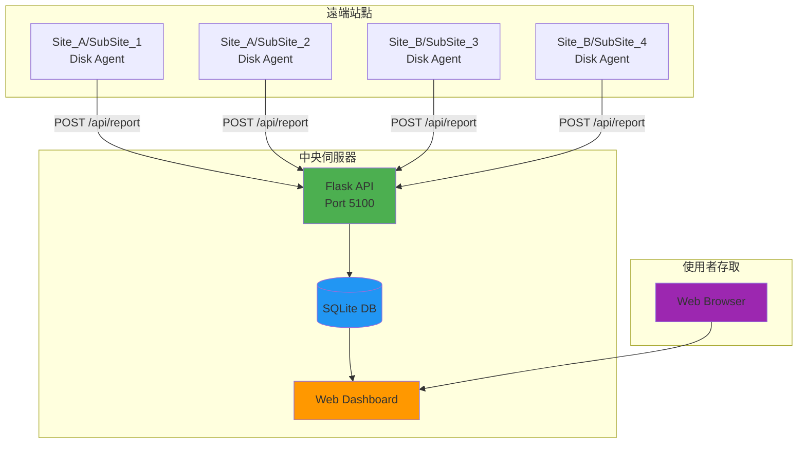

<div align="center">

  <samp>Simple. Powerful. Dashboard.</samp>
  <br><br>
  <a href="https://github.com/mile-chang/logHive">
    
  </a>
</div>

> 一個集中式監控系統，專為追蹤多個站點的硬碟使用情況而設計，提供即時視覺化和自動化資料收集功能。

[](https://github.com/mile-chang/logHive/actions/workflows/ci.yml)
[](https://github.com/mile-chang/logHive/actions/workflows/cd.yml)
[](https://opensource.org/licenses/MIT)
[](https://www.python.org/downloads/)
[](https://flask.palletsprojects.com/)

[English](README.md) | [日本語](README.ja.md)

---

## 概述

logHive 是一個監控系統，專為追蹤和視覺化多個站點的硬碟使用情況而設計。採用 Flask 構建，配備響應式網頁介面，提供即時監控、歷史追蹤和透過輕量級 Agent 進行自動化資料收集。

## 功能演示


*完整流程：登入 → 資料載入（含動畫）→ 互動式儀表板*

## 主要特色

- **現代深色主題** - 採用玻璃擬態設計與背景模糊效果
- **即時監控** - 智慧輪詢自動更新，搭配即時更新指示器
- **互動式圖表** - Chart.js 歷史趨勢圖，支援 7/30/90 天切換與動態資料點呈現
- **多站點支援** - 管理無限站點，可自訂配置
- **歷史分析** - 每月增長追蹤和使用統計
- **自動化 Agent** - 輕量級 bash 腳本搭配 Docker 容器化
- **監控堆疊** - Prometheus 指標 + Grafana 儀表板 + Node Exporter
- **CI/CD Pipeline** - GitHub Actions 搭配 ShellCheck、Docker Build 驗證和自動化部署

## 系統架構



## 快速開始

### 前置需求

- Python 3.8+ / Git
- Docker & Docker Compose（容器化部署）

### 本地開發

```bash
# Clone 並配置
git clone https://github.com/mile-chang/logHive.git
cd logHive
cp .env.example .env
nano .env  # 設定 SECRET_KEY、API_TOKEN、密碼

# 安裝並執行
python3 -m venv venv
source venv/bin/activate
pip install -r requirements.txt
python app.py
# → http://localhost:5100
```

### Docker 部署（雙 EC2）

請參閱完整的 **[部署指南](docs/deployment.zh-TW.md)**（[English](docs/deployment.md) | [日本語](docs/deployment.ja.md)）：

- EC2 #1 設定（LogHive + Prometheus + Grafana）
- EC2 #2 設定（6 個 Agent 容器 + Node Exporter）
- Security Group 設定
- 展示模式和清理指令
- 疑難排解

### CI/CD 流水線

請參閱 **[CI/CD 指南](docs/cicd.zh-TW.md)**（[English](docs/cicd.md) | [日本語](docs/cicd.ja.md)）了解自動化測試、建構和部署。

## API 端點

| 方法 | 端點 | 認證 | 說明 |
|------|------|------|------|
| POST | `/api/report` | API Token | 接收 Agent 硬碟使用報告 |
| GET | `/api/summary` | Session | 所有站點總覽 |
| GET | `/api/sites` | Session | 站點配置 |
| GET | `/api/history/<site>/<sub_site>/<server_type>` | Session | 歷史資料 |
| GET | `/api/monthly/<site>/<sub_site>/<server_type>` | Session | 月度統計 |
| GET | `/metrics` | 無 | Prometheus 指標 |

> [!WARNING]
> `/metrics` 端點無需認證。在生產環境中，請確保 port 5100 僅對可信來源開放。

## 專案結構

```
logHive/
├── app.py                        # 主 Flask 應用程式
├── config.py                     # 配置與站點定義
├── models.py                     # 資料庫模型與查詢
├── requirements.txt              # Python 依賴
├── .env.example                  # 環境變數範本
├── gunicorn_config.py            # 生產環境 WSGI 伺服器配置
├── docker-entrypoint.sh          # 容器入口腳本
├── Dockerfile                    # LogHive 容器映像
├── docker-compose.yml            # EC2 #1: LogHive + 監控堆疊
├── docker-compose.prod.yml       # EC2 #1: 生產環境覆寫（GHCR image）
├── docker-compose.agent.yml      # EC2 #2: Agent 容器
├── docker-compose.agent.prod.yml # EC2 #2: 生產環境覆寫（GHCR image）
├── agent/                        # Agent 腳本與容器
│   ├── disk_agent.sh             # 標準 Agent（環境變數配置）
│   ├── disk_agent_v2.sh          # SSH tunnel 版本
│   ├── file_generator.sh         # 隨機檔案產生器（展示用）
│   ├── entrypoint.sh             # Agent 容器入口點
│   ├── Dockerfile                # Agent 容器映像
│   ├── demo_generate.sh          # 一鍵展示觸發
│   ├── clean_agent_data.sh       # 資料清理
│   └── cron_setup.md             # Cron 配置指南
├── monitoring/                   # Prometheus & Grafana 配置
│   ├── prometheus.yml            # Prometheus 抓取配置
│   └── grafana/
│       ├── provisioning/         # 自動佈建配置
│       │   ├── datasources/datasource.yml
│       │   └── dashboards/dashboard.yml
│       └── dashboards/
│           └── loghive-dashboard.json
├── static/                       # 前端資源
│   ├── css/
│   │   ├── style.css             # 主要樣式表
│   │   ├── sidebar.css           # 側邊欄元件樣式
│   │   └── toppanel.css          # 頂部面板樣式
│   ├── js/
│   │   └── dashboard.js          # 儀表板邏輯 (Chart.js 圖表)
│   ├── favicon.svg               # 瀏覽器圖標
│   └── logo_full.svg             # LogHive Logo
├── templates/                    # Jinja2 HTML 模板
│   ├── dashboard.html            # 主儀表板頁面
│   └── login.html                # 登入頁面
├── tools/                        # 維護工具
│   ├── clean_db.py               # 資料庫清理
│   ├── migrate_db.py             # 資料庫遷移
│   └── update_passwords.py       # 密碼更新工具
├── deploy/                       # 伺服器部署腳本
│   ├── start.sh                  # 啟動應用程式
│   ├── stop.sh                   # 停止應用程式
│   ├── restart.sh                # 重啟應用程式
│   └── setup_ssh_security.sh     # SSH 安全強化
├── docs/                         # 文件
│   ├── deployment.md             # 完整部署指南 (EN)
│   ├── deployment.zh-TW.md       # 完整部署指南 (繁中)
│   ├── deployment.ja.md          # 完全デプロイガイド (日本語)
│   ├── cicd.md                   # CI/CD pipeline guide (EN)
│   ├── cicd.zh-TW.md             # CI/CD 流水線指南 (繁中)
│   ├── cicd.ja.md                # CI/CD パイプラインガイド (日本語)
│   └── screenshots/
│       └── demo.webp             # 功能展示動畫
├── data/                         # SQLite 資料庫 (gitignored)
└── logs/                         # 應用程式日誌 (gitignored)
```

## 技術堆疊

| 層級 | 技術 |
|------|------|
| 後端 | Flask, SQLite, Gunicorn, Prometheus Instrumentator |
| 前端 | Vanilla JS, Chart.js, Responsive CSS |
| 監控 | Prometheus, Grafana, Node Exporter |
| DevOps | Docker, GitHub Actions, ShellCheck |

## 安全性

- 基於環境的機密管理（`.env`，不硬編碼）
- Agent 的 API token 驗證
- 使用 Werkzeug 進行密碼雜湊
- 基於 Session 的網頁認證
- 分離測試/生產資料庫
- 支援 SSH tunnel 以適應受限網路
- `/metrics` 應限制為僅內部存取

## 授權

本專案採用 MIT 授權 - 詳情請參閱 [LICENSE](LICENSE) 文件。
