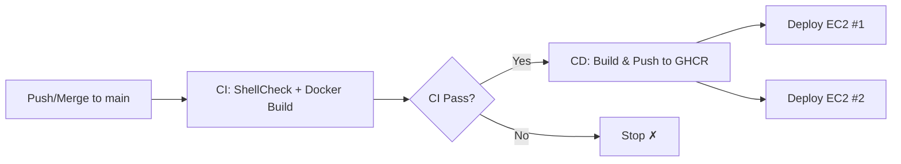

# CI/CD パイプラインガイド

GitHub Actions を使用した LogHive の自動テスト、ビルド、デプロイ。

[English](cicd.md) | [繁體中文](cicd.zh-TW.md)

---

## 目次

- [概要](#概要)
- [CI パイプライン](#ci-パイプライン)
- [CD パイプライン](#cd-パイプライン)
- [セットアップガイド](#セットアップガイド)
- [トリガーフロー](#トリガーフロー)
- [ロールバック](#ロールバック)
- [トラブルシューティング](#トラブルシューティング)

---

## 概要



| パイプライン | ファイル | トリガー | 目的 |
|-------------|---------|---------|------|
| CI | `.github/workflows/ci.yml` | `main`/`dev` への push、`main` への PR | Lint + ビルド検証 |
| CD | `.github/workflows/cd.yml` | `main` で CI 成功後 | ビルド、プッシュ、デプロイ |

---

## CI パイプライン

`main`/`dev` への push、および `main` への PR で実行されます。

### ジョブ

| ジョブ | 内容 |
|--------|------|
| **ShellCheck** | エージェントのシェルスクリプトの構文エラーとベストプラクティスを検証 |
| **Docker Build** | `Dockerfile`（LogHive）と `agent/Dockerfile`（Agent）のビルドを検証 |

> [!NOTE]
> CI はイメージのプッシュを**行いません**。コードの正確性とビルド可能性の検証のみです。

---

## CD パイプライン

`main` ブランチで CI が成功した後に自動的にトリガーされます。

### ジョブ

| ジョブ | 内容 |
|--------|------|
| **Build & Push** | Docker イメージをビルドし、GHCR に `latest` と SHA タグでプッシュ |
| **Deploy Server** | EC2 #1 に SSH 接続し、新しいイメージを pull してヘルスチェック付きで再起動 |
| **Deploy Agent** | EC2 #2 に SSH 接続し、新しいイメージを pull して全エージェントコンテナを再起動 |

### イメージタグ

各ビルドで、イメージごとに 2 つのタグが生成されます：

| タグ | 用途 |
|------|------|
| `latest` | 最新ビルドを常に指す |
| `<commit-sha>` | ロールバックとトレーサビリティ用の不変タグ |

### イメージ

| イメージ | レジストリパス |
|---------|--------------|
| LogHive | `ghcr.io/mile-chang/loghive/loghive` |
| Agent | `ghcr.io/mile-chang/loghive/loghive-agent` |

---

## セットアップガイド

### 1. GitHub Secrets の設定

**リポジトリ → Settings → Secrets and variables → Actions → New repository secret** に移動します。

| Secret | 説明 |
|--------|------|
| `EC2_HOST` | EC2 #1 の IP アドレス |
| `EC2_USER` | EC2 #1 の SSH ユーザー名（例：`ubuntu`） |
| `EC2_SSH_KEY` | SSH 秘密鍵（PEM 形式、両方の EC2 で共有） |
| `EC2_PROJECT_PATH` | EC2 #1 のプロジェクトパス（例：`/home/ubuntu/logHive`） |
| `EC2_AGENT_HOST` | EC2 #2 の IP アドレス |
| `EC2_AGENT_USER` | EC2 #2 の SSH ユーザー名 |
| `EC2_AGENT_PROJECT_PATH` | EC2 #2 のプロジェクトパス |
| `GHCR_PAT` | `read:packages` スコープ付きの GitHub Personal Access Token |

> [!IMPORTANT]
> `GITHUB_TOKEN` は GitHub Actions が自動的に提供します。手動で作成する必要はありません。

### 2. GHCR Personal Access Token の作成

1. **GitHub → Settings → Developer settings → Personal access tokens → Tokens (classic)** に移動
2. **Generate new token** をクリック
3. スコープを選択：`read:packages`
4. トークンをコピーし、`GHCR_PAT` シークレットとして保存

### 3. 本番環境 Compose ファイル（リポジトリに含まれています）

リポジトリには、`build:` を GHCR イメージに置き換える本番環境用のオーバーレイファイルが含まれています。**EC2 上でファイルを手動編集する必要はありません** — CD パイプラインが Docker Compose の `-f` マージ機能を使用して自動的に処理します：

- `docker-compose.prod.yml` — EC2 #1 用の GHCR イメージオーバーライド
- `docker-compose.agent.prod.yml` — EC2 #2 用の GHCR イメージオーバーライド

```bash
# CD パイプラインが EC2 #1 で実行する方法:
docker compose -f docker-compose.yml -f docker-compose.prod.yml up -d

# CD パイプラインが EC2 #2 で実行する方法:
docker compose -f docker-compose.agent.yml -f docker-compose.agent.prod.yml up -d
```

> [!NOTE]
> ローカル開発では、通常通り `docker compose up -d` を実行するだけです — prod オーバーレイなしでローカルビルドされます。

### 4. 初回デプロイテスト

> [!TIP]
> 初回テストでは、`cd.yml` の `deploy-server` と `deploy-agent` ジョブをコメントアウトしてください。`main` にプッシュして GHCR にイメージが表示されることを確認してから、コメントを外して再度プッシュしてください。

---

## トリガーフロー

```
開発者が dev にプッシュ
         ↓
PR 作成: dev → main
         ↓
CI 実行 (ShellCheck + Docker Build)
         ↓
PR を main にマージ
         ↓
main で CI 実行
         ↓
CI 成功 → CD 自動トリガー
         ↓
イメージをビルドし GHCR にプッシュ
         ↓
EC2 #1 & #2 に並行デプロイ
```

---

## ロールバック

デプロイに問題が発生した場合、SHA タグを使用して以前のバージョンにロールバック：

```bash
# EC2 #1 で
cd ~/logHive

# 特定のコミットにロールバック:
docker compose -f docker-compose.yml -f docker-compose.prod.yml down
docker pull ghcr.io/mile-chang/loghive/loghive:<previous-commit-sha>
docker tag ghcr.io/mile-chang/loghive/loghive:<previous-commit-sha> ghcr.io/mile-chang/loghive/loghive:latest
docker compose -f docker-compose.yml -f docker-compose.prod.yml up -d
```

> [!NOTE]
> コミット SHA は GitHub Actions の CD 実行ログまたは `git log` から確認できます。

---

## トラブルシューティング

### CI の問題

| 問題 | 解決策 |
|------|--------|
| ShellCheck 失敗 | エラーログに表示された問題を修正 |
| Docker ビルド失敗 | `Dockerfile` の構文と `requirements.txt` を確認 |

### CD の問題

| 問題 | 解決策 |
|------|--------|
| CD がトリガーされない | `main` で CI が成功したか確認、ワークフロー名が `"CI"` と一致するか確認 |
| GHCR プッシュ失敗 | `packages: write` パーミッションを確認 |
| SSH 接続失敗 | `EC2_HOST`、`EC2_USER`、`EC2_SSH_KEY` シークレットを確認 |
| ヘルスチェック失敗 | LogHive が正しく起動しているか確認：`docker compose logs loghive` |
| エージェントコンテナ未起動 | EC2 #2 で `docker compose -f docker-compose.agent.yml logs` を確認 |
| EC2 で GHCR pull 失敗 | `GHCR_PAT` に `read:packages` スコープがあるか確認 |

### デプロイ状況の確認

```bash
# EC2 #1 で
docker ps                       # コンテナ状態
docker compose -f docker-compose.yml -f docker-compose.prod.yml logs loghive   # アプリログ
curl http://localhost:5100/     # ヘルスチェック

# EC2 #2 で
docker compose -f docker-compose.agent.yml -f docker-compose.agent.prod.yml ps   # エージェント状態
```

---

## セキュリティノート

- すべてのシークレットは GitHub リポジトリシークレットに保存（暗号化して保管）
- SSH キーは `appleboy/ssh-action` の `envs` メカニズムで渡される（スクリプト内で展開されない）
- `GHCR_PAT` は環境変数で伝送、ログに表示されない
- GitHub Actions はログ出力でシークレット値を自動的にマスク
- すべてのスクリプトは `set -e` でエラー時に即座に停止
