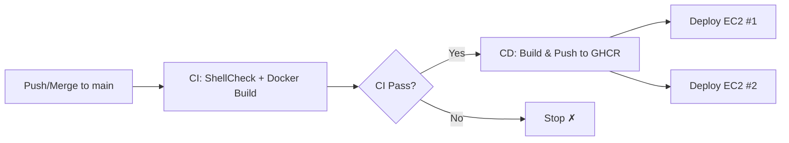

# CI/CD Pipeline Guide

Automated testing, building, and deployment for LogHive using GitHub Actions.

[繁體中文](cicd.zh-TW.md) | [日本語](cicd.ja.md)

---

## Table of Contents

- [Overview](#overview)
- [CI Pipeline](#ci-pipeline)
- [CD Pipeline](#cd-pipeline)
- [Setup Guide](#setup-guide)
- [Trigger Flow](#trigger-flow)
- [Rollback](#rollback)
- [Troubleshooting](#troubleshooting)

---

## Overview



| Pipeline | File | Trigger | Purpose |
|----------|------|---------|---------|
| CI | `.github/workflows/ci.yml` | Push to `main`/`dev`, PR to `main` | Lint + Build validation |
| CD | `.github/workflows/cd.yml` | CI passes on `main` | Build, push, deploy |

---

## CI Pipeline

Runs on every push to `main`/`dev` and on pull requests to `main`.

### Jobs

| Job | What it does |
|-----|-------------|
| **ShellCheck** | Lints all agent shell scripts for syntax errors and best practices |
| **Docker Build** | Validates both `Dockerfile` (LogHive) and `agent/Dockerfile` (Agent) build successfully |

> [!NOTE]
> CI does **not** push any images. It only validates that the code is correct and buildable.

---

## CD Pipeline

Triggered automatically after CI passes on the `main` branch.

### Jobs

| Job | What it does |
|-----|-------------|
| **Build & Push** | Builds Docker images and pushes to GitHub Container Registry (GHCR) with `latest` and SHA tags |
| **Deploy Server** | SSHs into EC2 #1, pulls the new image, restarts LogHive with health check |
| **Deploy Agent** | SSHs into EC2 #2, pulls the new image, restarts all agent containers |

### Image Tags

Each build produces two tags per image:

| Tag | Purpose |
|-----|---------|
| `latest` | Always points to the newest build |
| `<commit-sha>` | Immutable tag for rollback and traceability |

### Images

| Image | Registry Path |
|-------|--------------|
| LogHive | `ghcr.io/mile-chang/loghive/loghive` |
| Agent | `ghcr.io/mile-chang/loghive/loghive-agent` |

---

## Setup Guide

### 1. GitHub Secrets

Go to **Repository → Settings → Secrets and variables → Actions → New repository secret**.

| Secret | Description |
|--------|-------------|
| `EC2_HOST` | EC2 #1 IP address |
| `EC2_USER` | EC2 #1 SSH username (e.g. `ubuntu`) |
| `EC2_SSH_KEY` | SSH private key (PEM format, shared by both EC2s) |
| `EC2_PROJECT_PATH` | Project path on EC2 #1 (e.g. `/home/ubuntu/logHive`) |
| `EC2_AGENT_HOST` | EC2 #2 IP address |
| `EC2_AGENT_USER` | EC2 #2 SSH username |
| `EC2_AGENT_PROJECT_PATH` | Project path on EC2 #2 |
| `GHCR_PAT` | GitHub Personal Access Token with `read:packages` scope |

> [!IMPORTANT]
> `GITHUB_TOKEN` is automatically provided by GitHub Actions — do NOT create it manually.

### 2. Create GHCR Personal Access Token

1. Go to **GitHub → Settings → Developer settings → Personal access tokens → Tokens (classic)**
2. Click **Generate new token**
3. Select scope: `read:packages`
4. Copy the token and save as `GHCR_PAT` secret

### 3. Production Compose Files (Already in Repo)

The repository includes production overlay files that replace `build:` with GHCR images. **No manual editing is needed on EC2** — the CD pipeline handles this automatically using Docker Compose's `-f` merge feature:

- `docker-compose.prod.yml` — GHCR image override for EC2 #1
- `docker-compose.agent.prod.yml` — GHCR image override for EC2 #2

```bash
# How the CD pipeline runs on EC2 #1:
docker compose -f docker-compose.yml -f docker-compose.prod.yml up -d

# How the CD pipeline runs on EC2 #2:
docker compose -f docker-compose.agent.yml -f docker-compose.agent.prod.yml up -d
```

> [!NOTE]
> For local development, just run `docker compose up -d` as usual — it builds locally without the prod overlay.

### 4. First Deployment Test

> [!TIP]
> For the first test, comment out the `deploy-server` and `deploy-agent` jobs in `cd.yml`. Push to `main` and verify images appear on GHCR. Then uncomment and push again.

---

## Trigger Flow

```
Developer pushes to dev
         ↓
Create PR: dev → main
         ↓
CI runs (ShellCheck + Docker Build)
         ↓
Merge PR to main
         ↓
CI runs on main
         ↓
CI passes → CD triggers automatically
         ↓
Build & Push images to GHCR
         ↓
Deploy to EC2 #1 & #2 in parallel
```

---

## Rollback

If a deployment causes issues, rollback to a previous version using the SHA tag:

```bash
# On EC2 #1
cd ~/logHive

# To rollback to a specific commit:
docker compose -f docker-compose.yml -f docker-compose.prod.yml down
docker pull ghcr.io/mile-chang/loghive/loghive:<previous-commit-sha>
docker tag ghcr.io/mile-chang/loghive/loghive:<previous-commit-sha> ghcr.io/mile-chang/loghive/loghive:latest
docker compose -f docker-compose.yml -f docker-compose.prod.yml up -d
```

> [!NOTE]
> Find the commit SHA from the GitHub Actions CD run log or from `git log`.

---

## Troubleshooting

### CI Issues

| Problem | Solution |
|---------|----------|
| ShellCheck fails | Fix shell script issues shown in the error log |
| Docker build fails | Check `Dockerfile` syntax and `requirements.txt` |

### CD Issues

| Problem | Solution |
|---------|----------|
| CD doesn't trigger | Ensure CI passed on `main` branch, check workflow name matches `"CI"` |
| GHCR push fails | Verify `packages: write` permission is set |
| SSH connection fails | Check `EC2_HOST`, `EC2_USER`, `EC2_SSH_KEY` secrets |
| Health check fails | Check if LogHive starts correctly: `docker compose logs loghive` |
| Agent containers not running | Check `docker compose -f docker-compose.agent.yml logs` on EC2 #2 |
| GHCR pull fails on EC2 | Verify `GHCR_PAT` has `read:packages` scope |

### Checking Deployment Status

```bash
# On EC2 #1
docker ps                       # Container status
docker compose -f docker-compose.yml -f docker-compose.prod.yml logs loghive   # App logs
curl http://localhost:5100/     # Health check

# On EC2 #2
docker compose -f docker-compose.agent.yml -f docker-compose.agent.prod.yml ps   # Agent status
```

---

## Security Notes

- All secrets are stored in GitHub repository secrets (encrypted at rest)
- SSH keys are passed via `appleboy/ssh-action`'s `envs` mechanism (not interpolated in scripts)
- `GHCR_PAT` is transmitted via environment variable, never appears in logs
- GitHub Actions automatically masks secret values in log output
- All scripts use `set -e` to fail fast on errors
