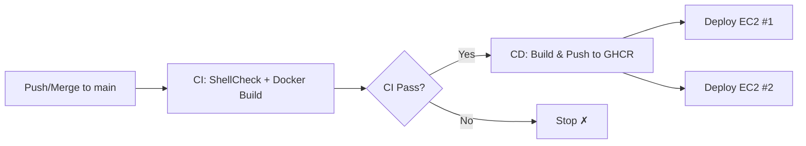

# CI/CD 流水線指南

使用 GitHub Actions 實現 LogHive 的自動化測試、建構與部署。

[English](cicd.md) | [日本語](cicd.ja.md)

---

## 目錄

- [概覽](#概覽)
- [CI 流水線](#ci-流水線)
- [CD 流水線](#cd-流水線)
- [設定指南](#設定指南)
- [觸發流程](#觸發流程)
- [回滾](#回滾)
- [故障排除](#故障排除)

---

## 概覽



| 流水線 | 檔案 | 觸發條件 | 用途 |
|--------|------|---------|------|
| CI | `.github/workflows/ci.yml` | Push 到 `main`/`dev`、PR 到 `main` | Lint + 建構驗證 |
| CD | `.github/workflows/cd.yml` | `main` 上 CI 通過後 | 建構、推送、部署 |

---

## CI 流水線

在每次 push 到 `main`/`dev` 以及 pull request 到 `main` 時執行。

### 工作

| 工作 | 內容 |
|------|------|
| **ShellCheck** | 檢查所有 agent shell script 的語法錯誤和最佳實踐 |
| **Docker Build** | 驗證 `Dockerfile`（LogHive）和 `agent/Dockerfile`（Agent）是否能成功建構 |

> [!NOTE]
> CI **不會**推送任何 image，僅驗證程式碼的正確性和可建構性。

---

## CD 流水線

在 `main` 分支上 CI 通過後自動觸發。

### 工作

| 工作 | 內容 |
|------|------|
| **Build & Push** | 建構 Docker image 並推送到 GHCR，標記 `latest` 和 SHA tag |
| **Deploy Server** | SSH 進入 EC2 #1，pull 新 image，帶健康檢查地重啟 LogHive |
| **Deploy Agent** | SSH 進入 EC2 #2，pull 新 image，重啟所有 agent 容器 |

### Image 標籤

每次建構會為每個 image 產生兩個標籤：

| 標籤 | 用途 |
|------|------|
| `latest` | 始終指向最新建構 |
| `<commit-sha>` | 用於回滾和追蹤的不可變標籤 |

### Image

| Image | Registry 路徑 |
|-------|--------------|
| LogHive | `ghcr.io/mile-chang/loghive/loghive` |
| Agent | `ghcr.io/mile-chang/loghive/loghive-agent` |

---

## 設定指南

### 1. 設定 GitHub Secrets

前往 **Repository → Settings → Secrets and variables → Actions → New repository secret**。

| Secret | 說明 |
|--------|------|
| `EC2_HOST` | EC2 #1 的 IP 位址 |
| `EC2_USER` | EC2 #1 的 SSH 使用者名稱（例如 `ubuntu`） |
| `EC2_SSH_KEY` | SSH 私鑰（PEM 格式，兩台 EC2 共用） |
| `EC2_PROJECT_PATH` | EC2 #1 上的專案路徑（例如 `/home/ubuntu/logHive`） |
| `EC2_AGENT_HOST` | EC2 #2 的 IP 位址 |
| `EC2_AGENT_USER` | EC2 #2 的 SSH 使用者名稱 |
| `EC2_AGENT_PROJECT_PATH` | EC2 #2 上的專案路徑 |
| `GHCR_PAT` | 具有 `read:packages` 權限的 GitHub Personal Access Token |

> [!IMPORTANT]
> `GITHUB_TOKEN` 由 GitHub Actions 自動提供，**不需要**手動建立。

### 2. 建立 GHCR Personal Access Token

1. 前往 **GitHub → Settings → Developer settings → Personal access tokens → Tokens (classic)**
2. 點擊 **Generate new token**
3. 選擇權限範圍：`read:packages`
4. 複製 token 並儲存為 `GHCR_PAT` secret

### 3. 生產環境 Compose 檔案（已包含在 Repo 中）

專案中已包含生產環境的 overlay 檔案，用 GHCR image 取代 `build:`。**不需要手動在 EC2 上修改任何檔案** — CD 流水線會使用 Docker Compose 的 `-f` 合併功能自動處理：

- `docker-compose.prod.yml` — EC2 #1 的 GHCR image 覆寫
- `docker-compose.agent.prod.yml` — EC2 #2 的 GHCR image 覆寫

```bash
# CD 流水線在 EC2 #1 上的執行方式：
docker compose -f docker-compose.yml -f docker-compose.prod.yml up -d

# CD 流水線在 EC2 #2 上的執行方式：
docker compose -f docker-compose.agent.yml -f docker-compose.agent.prod.yml up -d
```

> [!NOTE]
> 本地開發時，直接執行 `docker compose up -d` 即可 — 不會載入 prod overlay，會在本地建構。

### 4. 首次部署測試

> [!TIP]
> 首次測試時，建議先在 `cd.yml` 中註解掉 `deploy-server` 和 `deploy-agent` 工作。Push 到 `main` 後確認 GHCR 上出現 image，再取消註解重新 push。

---

## 觸發流程

```
開發者 push 到 dev
         ↓
建立 PR: dev → main
         ↓
CI 執行 (ShellCheck + Docker Build)
         ↓
合併 PR 到 main
         ↓
main 上執行 CI
         ↓
CI 通過 → CD 自動觸發
         ↓
建構 image 並推送到 GHCR
         ↓
並行部署到 EC2 #1 & #2
```

---

## 回滾

如果部署出現問題，使用 SHA tag 回滾到之前的版本：

```bash
# 在 EC2 #1 上
cd ~/logHive

# 回滾到特定 commit：
docker compose -f docker-compose.yml -f docker-compose.prod.yml down
docker pull ghcr.io/mile-chang/loghive/loghive:<previous-commit-sha>
docker tag ghcr.io/mile-chang/loghive/loghive:<previous-commit-sha> ghcr.io/mile-chang/loghive/loghive:latest
docker compose -f docker-compose.yml -f docker-compose.prod.yml up -d
```

> [!NOTE]
> Commit SHA 可以從 GitHub Actions 的 CD 執行日誌或 `git log` 中找到。

---

## 故障排除

### CI 問題

| 問題 | 解決方式 |
|------|---------|
| ShellCheck 失敗 | 修正錯誤日誌中顯示的 shell script 問題 |
| Docker 建構失敗 | 檢查 `Dockerfile` 語法和 `requirements.txt` |

### CD 問題

| 問題 | 解決方式 |
|------|---------|
| CD 沒有觸發 | 確認 CI 在 `main` 上通過，檢查 workflow 名稱是否與 `"CI"` 一致 |
| GHCR 推送失敗 | 確認設定了 `packages: write` 權限 |
| SSH 連線失敗 | 檢查 `EC2_HOST`、`EC2_USER`、`EC2_SSH_KEY` secrets |
| 健康檢查失敗 | 確認 LogHive 正常啟動：`docker compose logs loghive` |
| Agent 容器未執行 | 在 EC2 #2 上檢查 `docker compose -f docker-compose.agent.yml logs` |
| EC2 上 GHCR pull 失敗 | 確認 `GHCR_PAT` 有 `read:packages` 權限 |

### 檢查部署狀態

```bash
# 在 EC2 #1 上
docker ps                       # 容器狀態
docker compose -f docker-compose.yml -f docker-compose.prod.yml logs loghive   # 應用程式日誌
curl http://localhost:5100/     # 健康檢查

# 在 EC2 #2 上
docker compose -f docker-compose.agent.yml -f docker-compose.agent.prod.yml ps   # Agent 狀態
```

---

## 安全注意事項

- 所有 secrets 儲存在 GitHub repository secrets 中（加密儲存）
- SSH 金鑰透過 `appleboy/ssh-action` 的 `envs` 機制傳遞（不在 script 中展開）
- `GHCR_PAT` 以環境變數方式傳輸，不會出現在日誌中
- GitHub Actions 會自動遮蔽日誌輸出中的 secret 值
- 所有 script 使用 `set -e` 在錯誤時立即停止
