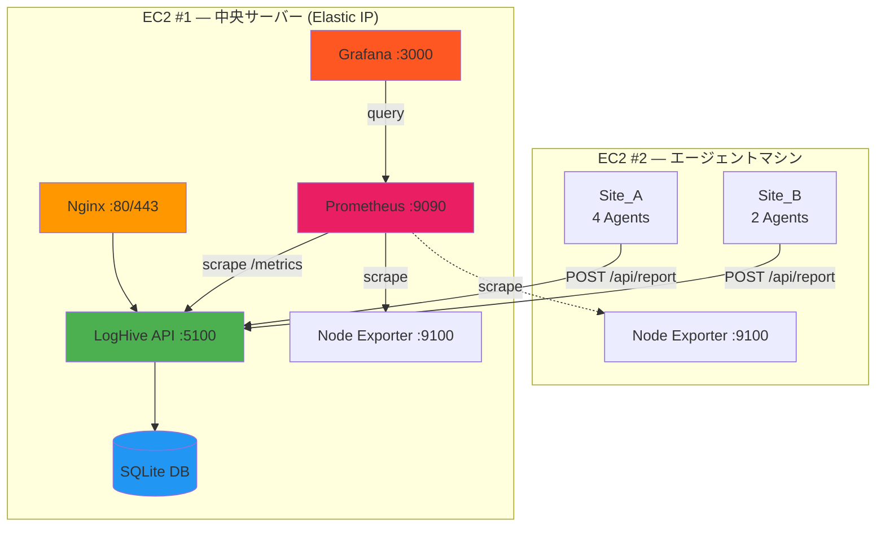

# デプロイガイド

LogHive のデプロイに関する完全なガイド — ローカル Docker から本番環境の 2台 EC2 アーキテクチャ + モニタリングスタックまで。

---

## 目次

- [前提条件](#前提条件)
- [Part 1: Docker 基本](#part-1-docker-基本)
- [Part 2: EC2 #1 — 中央サーバー](#part-2-ec2-1--中央サーバー)
- [Part 3: EC2 #2 — エージェントマシン](#part-3-ec2-2--エージェントマシン)
- [Part 4: エージェント設定](#part-4-エージェント設定)
- [Part 5: エージェントデプロイ (非Docker)](#part-5-エージェントデプロイ-非docker)
- [Part 6: 運用](#part-6-運用)
- [トラブルシューティング](#トラブルシューティング)

---

## アーキテクチャ概要



---

## 前提条件

- Docker Engine 20.10+ & Docker Compose 2.0+
- AWS EC2 インスタンス 2台 (Ubuntu 24.04 LTS)
  - EC2 #1: t3.micro (1 vCPU, 1GB RAM) — Elastic IP 付き中央サーバー
  - EC2 #2: t2.micro — エージェントマシン
- セキュリティグループの設定（下記参照）

### セキュリティグループ設定

> [!IMPORTANT]
> 攻撃対象を最小限にするため、アクセスを制限してください。

| EC2 | ポート | ソース | 用途 |
|-----|--------|--------|------|
| #1 | 22 | 自分の IP のみ | SSH |
| #1 | 80 | 0.0.0.0/0 | HTTP (Nginx) |
| #1 | 443 | 0.0.0.0/0 | HTTPS (Nginx) |
| #1 | 3000 | 自分の IP のみ | Grafana |
| #1 | 5100 | EC2 #2 プライベート IP | エージェント API エンドポイント |
| #1 | 9090 | — (内部のみ) | Prometheus（公開禁止） |
| #2 | 22 | 自分の IP のみ | SSH |
| #2 | 9100 | EC2 #1 プライベート IP | Node Exporter スクレイプ |

> [!TIP]
> 同じ VPC 内の EC2 インスタンス間は**プライベート IP** を使用すると、セキュリティが向上しデータ転送コストがゼロになります。

---

## Part 1: Docker 基本

### 環境変数

| 変数 | 説明 | デフォルト |
|------|------|------------|
| `ENVIRONMENT` | 実行環境 | `production` |
| `PORT` | サービスポート | `5100` |
| `SECRET_KEY` | Flask シークレットキー | *要変更* |
| `API_TOKEN` | API 認証トークン | *要変更* |
| `ADMIN_USERNAME` | 管理者ユーザー名 | `admin` |
| `ADMIN_PASSWORD` | 管理者パスワード | *要変更* |
| `TEST_USERNAME` | テストユーザー名 | `test` |
| `TEST_PASSWORD` | テストパスワード | *要変更* |
| `GF_ADMIN_USER` | Grafana 管理者ユーザー | `admin` |
| `GF_ADMIN_PASSWORD` | Grafana 管理者パスワード | *要変更* |

### 設定の優先順位

```
1. docker-compose.yml environment   ← 最高優先度（他を上書き）
2. .env ファイル                     ← 中優先度
3. config.py デフォルト値            ← 最低優先度（フォールバック）
```

### データ永続化

Docker Compose は以下のボリュームを自動作成します：

| ボリューム | 用途 |
|------------|------|
| `loghive-data` | SQLite データベースファイル |
| `loghive-logs` | アプリケーションログ |
| `prometheus-data` | Prometheus 時系列データ |
| `grafana-data` | Grafana 設定とダッシュボード |

### ローカルクイックスタート

```bash
cp .env.example .env
nano .env  # SECRET_KEY, API_TOKEN, パスワードを設定

docker compose up -d        # ビルドして起動
docker compose logs -f       # ログを表示
docker compose down          # 停止
```

アプリケーション: `http://localhost:5100`

---

## Part 2: EC2 #1 — 中央サーバー

### 1. 接続と Docker のインストール

```bash
ssh -i your-key.pem ubuntu@your-ec2-ip
```

```bash
sudo apt update && sudo apt upgrade -y && \
sudo apt install -y docker.io docker-compose-v2 git curl nginx certbot python3-certbot-nginx htop && \
sudo systemctl start docker && \
sudo systemctl enable docker && \
sudo usermod -aG docker ubuntu && \
echo "✅ インストール完了！ログアウトして再ログインしてください。"
```

```bash
exit
ssh -i your-key.pem ubuntu@your-ec2-ip
```

### 2. クローンと設定

```bash
cd ~ && \
git clone https://github.com/mile-chang/logHive.git && \
cd logHive

# セキュアな認証情報を自動生成
cp .env.example .env && \
SECRET_KEY=$(python3 -c "import secrets; print(secrets.token_hex(32))") && \
API_TOKEN=$(python3 -c "import secrets; print(secrets.token_hex(32))") && \
sed -i "s/your-secret-key-here-change-me/$SECRET_KEY/" .env && \
sed -i "s/your-api-token-here-change-me/$API_TOKEN/" .env && \
ADMIN_PASS=$(python3 -c "import secrets; print(secrets.token_urlsafe(16))") && \
sed -i "s/change-me-in-production/$ADMIN_PASS/" .env && \
echo "✅ 認証情報を設定しました"
```

### 3. Prometheus の設定

`monitoring/prometheus.yml` を編集 — `EC2_2_IP` を EC2 #2 の**プライベート IP** に置き換え：

```bash
nano monitoring/prometheus.yml
```

```yaml
  - job_name: 'node-exporter-ec2-2'
    static_configs:
      - targets: ['<EC2_2_PRIVATE_IP>:9100']
```

### 4. 全サービスの起動

```bash
docker compose up -d

# 全サービスが稼働していることを確認
docker compose ps
```

| サービス | URL | 認証情報 |
|----------|-----|----------|
| LogHive | `http://<Elastic-IP>:5100` | `.env` で設定 |
| Grafana | `http://<Elastic-IP>:3000` | `.env` で `GF_ADMIN_PASSWORD` を設定 |
| Prometheus | `http://localhost:9090` | 内部のみ |

> [!CAUTION]
> 初回ログイン時に Grafana のデフォルトパスワードを変更してください。

### 5. Nginx リバースプロキシ

```bash
sudo tee /etc/nginx/sites-available/loghive > /dev/null <<'EOF'
server {
    listen 80;
    server_name _;

    add_header X-Frame-Options "SAMEORIGIN" always;
    add_header X-Content-Type-Options "nosniff" always;
    add_header X-XSS-Protection "1; mode=block" always;

    client_max_body_size 10M;

    location / {
        proxy_pass http://127.0.0.1:5100;
        proxy_set_header Host $host;
        proxy_set_header X-Real-IP $remote_addr;
        proxy_set_header X-Forwarded-For $proxy_add_x_forwarded_for;
        proxy_set_header X-Forwarded-Proto $scheme;
        proxy_connect_timeout 60s;
        proxy_send_timeout 60s;
        proxy_read_timeout 60s;
    }

    location /static/ {
        proxy_pass http://127.0.0.1:5100/static/;
        proxy_cache_valid 200 1d;
        add_header Cache-Control "public, immutable";
    }
}
EOF

sudo ln -sf /etc/nginx/sites-available/loghive /etc/nginx/sites-enabled/ && \
sudo rm -f /etc/nginx/sites-enabled/default && \
sudo nginx -t && sudo systemctl reload nginx && sudo systemctl enable nginx
```

### 6. ファイアウォール

```bash
sudo ufw allow 22/tcp && sudo ufw allow 80/tcp && sudo ufw allow 443/tcp && \
sudo ufw --force enable
```

> [!WARNING]
> Docker が公開するポート（例: 5100）は iptables の DOCKER chain 経由で **UFW を完全にバイパス**します。ポート 5100 のアクセス制御は UFW ではなく **AWS Security Group** で行う必要があります。

### 7. Swap の有効化（t3.micro 推奨）

```bash
sudo fallocate -l 1G /swapfile && sudo chmod 600 /swapfile && \
sudo mkswap /swapfile && sudo swapon /swapfile && \
echo '/swapfile none swap sw 0 0' | sudo tee -a /etc/fstab && \
echo 'vm.swappiness=10' | sudo tee -a /etc/sysctl.conf && sudo sysctl -p
```

### 8. HTTPS（オプション — ドメインが必要）

```bash
sudo certbot --nginx -d yourdomain.com
```

### 9. セキュリティ強化

```bash
# Fail2Ban（ブルートフォース保護）
sudo apt install -y fail2ban && \
sudo cp /etc/fail2ban/jail.conf /etc/fail2ban/jail.local && \
sudo systemctl enable fail2ban && sudo systemctl start fail2ban

# 自動セキュリティアップデート
sudo apt install -y unattended-upgrades && \
sudo dpkg-reconfigure -plow unattended-upgrades
```

### EC2 #1 デプロイの確認

```bash
docker ps                        # コンテナの稼働確認
curl http://localhost:5100       # アプリの応答確認
sudo systemctl status nginx      # Nginx の稼働確認
sudo ufw status                  # ファイアウォールの確認
```

---

## Part 3: EC2 #2 — エージェントマシン

### 1. Docker のインストール

```bash
sudo apt update && sudo apt install -y docker.io docker-compose-v2 git && \
sudo systemctl start docker && sudo systemctl enable docker && \
sudo usermod -aG docker ubuntu
# ログアウトして再ログイン
```

### 2. クローンと設定

```bash
cd ~ && git clone https://github.com/mile-chang/logHive.git && cd logHive
```

### 3. `.env` ファイルの作成

> [!WARNING]
> ターミナルで `export` を使用しないでください — トークンがシェル履歴に残ります。`.env` ファイルを使用してください。

ネットワーク構成に応じて `CENTRAL_SERVER_URL` を選択してください：

| 方式 | URL | 使用場面 |
|------|-----|----------|
| プライベート IP（推奨） | `http://<EC2-1-プライベートIP>:5100/api/report` | 同一 VPC — 最速、無料、最も安全 |
| Elastic IP 経由 Nginx | `http://<EC2-1-Elastic-IP>/api/report` | クロス VPC または外部エージェント（ポート 80） |

```bash
# 方式 A: 同一 VPC（推奨）
cat > .env <<EOF
CENTRAL_SERVER_URL=http://<EC2-1-プライベートIP>:5100/api/report
API_TOKEN=<EC2-1と同じAPI_TOKEN>
FILE_GEN_INTERVAL=86400
REPORT_INTERVAL=3600
EOF

# 方式 B: クロス VPC / 外部（Nginx ポート 80 経由）
cat > .env <<EOF
CENTRAL_SERVER_URL=http://<EC2-1-Elastic-IP>/api/report
API_TOKEN=<EC2-1と同じAPI_TOKEN>
FILE_GEN_INTERVAL=86400
REPORT_INTERVAL=3600
EOF
```

> [!TIP]
> ポート 5100 はファイアウォールルールにより **Elastic IP 経由で直接アクセスできません**。外部エージェントは Nginx のポート 80/443 を経由する必要があります。

### 4. エージェントの起動

```bash
docker compose -f docker-compose.agent.yml up -d

# 全 7 サービス (6 エージェント + node-exporter) を確認
docker compose -f docker-compose.agent.yml ps

# ログの監視
docker compose -f docker-compose.agent.yml logs -f
```

---

## Part 4: エージェント設定

### 事前設定済みエージェントコンテナ

| # | SITE | SUB_SITE | SERVER_TYPE | コンテナ名 |
|---|------|----------|-------------|------------|
| 1 | Site_A | SubSite_1 | log_server | agent-a-sub1-log |
| 2 | Site_A | SubSite_1 | backup_server | agent-a-sub1-backup |
| 3 | Site_A | SubSite_2 | log_server | agent-a-sub2-log |
| 4 | Site_A | SubSite_2 | backup_server | agent-a-sub2-backup |
| 5 | Site_B | SubSite_3 | log_server | agent-b-sub3-log |
| 6 | Site_B | SubSite_3 | backup_log_server | agent-b-sub3-backup |

### 環境変数

| 変数 | デフォルト | 説明 |
|------|-----------|------|
| `CENTRAL_SERVER_URL` | — | EC2 #1 LogHive API エンドポイント |
| `API_TOKEN` | — | API 認証トークン |
| `SITE` | `Site_A` | サイト名 |
| `SUB_SITE` | `SubSite_1` | サブサイト名 |
| `SERVER_TYPE` | `log_server` | サーバータイプ |
| `FILE_GEN_INTERVAL` | `86400` | ファイル生成間隔（秒） |
| `REPORT_INTERVAL` | `3600` | エージェント報告間隔（秒） |
| `MAX_SIZE_MB` | `500` | エージェントあたりの最大データ容量 (MB) |

### 各エージェントの動作

各コンテナは 2 つのバックグラウンドプロセスを実行します：
1. **`file_generator.sh`** — `FILE_GEN_INTERVAL` ごとに `/data` にランダムファイル (1KB–20MB) を作成
2. **`disk_agent.sh`** — `du -sk /data` を実行し、実サイズを EC2 #1 に POST

各エージェントは独自の独立した Docker ボリュームを持ちます。

### デモモード

```bash
# 高速間隔 — コンテナ起動前に .env で設定
FILE_GEN_INTERVAL=60     # 60 秒ごとにファイル生成
REPORT_INTERVAL=30       # 30 秒ごとに報告
```

### 手動デモトリガー

```bash
# 即座にファイルを生成
./agent/demo_generate.sh        # エージェントあたり 1 ファイル
./agent/demo_generate.sh 5      # エージェントあたり 5 ファイル

# 全エージェントに即座に報告させる
for c in agent-a-sub1-log agent-a-sub1-backup agent-a-sub2-log agent-a-sub2-backup agent-b-sub3-log agent-b-sub3-backup; do
  docker exec $c /opt/agent/disk_agent.sh
done
```

### クリーンアップ

```bash
# データのみ削除（コンテナは稼働続行）
./agent/clean_agent_data.sh

# すべて停止して全データ削除
docker compose -f docker-compose.agent.yml down -v
```

### ディスク容量の見積もり

| 項目 | サイズ |
|------|--------|
| EC2 #2 合計ディスク | 8 GB |
| OS + Docker オーバーヘッド | 約 3 GB |
| エージェント利用可能容量 | 約 5 GB |
| エージェントあたり最大 (`MAX_SIZE_MB`) | 500 MB |
| 6 エージェント × 500 MB | 3 GB ✅ |

---

## Part 5: エージェントデプロイ (非Docker)

cron を使用して本番サーバーにエージェントを直接デプロイする場合：

```bash
# 1. エージェントをリモートサーバーにコピー
scp agent/disk_agent.sh user@remote-server:/opt/disk-agent/

# 2. エージェントの設定
nano /opt/disk-agent/disk_agent.sh
# 編集: CENTRAL_SERVER_URL, API_TOKEN, SITE, SUB_SITE, SERVER_TYPE

# 3. 実行権限を付与してテスト
chmod +x /opt/disk-agent/disk_agent.sh
/opt/disk-agent/disk_agent.sh

# 4. cron でスケジュール（毎時）
crontab -e
0 * * * * /opt/disk-agent/disk_agent.sh >> /var/log/disk-agent.log 2>&1
```

制限されたネットワークの場合、SSH トンネルサポート付きの `disk_agent_v2.sh` を使用してください。

---

## Part 6: 運用

### 自動バックアップ

```bash
mkdir -p ~/scripts && \
cat > ~/scripts/backup-loghive.sh <<'EOF'
#!/bin/bash
BACKUP_DIR=~/backups
DATE=$(date +%Y%m%d_%H%M%S)
mkdir -p $BACKUP_DIR
docker run --rm -v loghive_loghive-data:/data -v $BACKUP_DIR:/backup \
  alpine tar czf /backup/loghive-data-$DATE.tar.gz -C /data .
cp ~/logHive/.env $BACKUP_DIR/.env-$DATE
find $BACKUP_DIR -name "loghive-data-*.tar.gz" -mtime +7 -delete
find $BACKUP_DIR -name ".env-*" -mtime +7 -delete
echo "[$(date)] バックアップ完了: loghive-data-$DATE.tar.gz"
EOF

chmod +x ~/scripts/backup-loghive.sh && \
(crontab -l 2>/dev/null; echo "0 2 * * * /home/ubuntu/scripts/backup-loghive.sh >> /home/ubuntu/backup.log 2>&1") | crontab -
```

### バックアップとリストア（手動）

```bash
# バックアップ
docker run --rm \
  -v loghive-data:/data \
  -v $(pwd):/backup \
  alpine tar czf /backup/loghive-data-backup.tar.gz -C /data .

# リストア
docker run --rm \
  -v loghive-data:/data \
  -v $(pwd):/backup \
  alpine tar xzf /backup/loghive-data-backup.tar.gz -C /data
```

### 一般的なコマンド

```bash
cd ~/logHive
docker compose ps                # ステータス
docker compose logs -f           # ログを表示
docker compose logs --tail=100   # 最近のログ
docker compose restart           # 再起動
docker compose down              # 停止
docker compose up -d             # 起動
docker compose up -d --build     # リビルドして起動
docker compose exec loghive bash # シェルに入る
git pull && docker compose up -d --build  # アップデート
```

### パスワード更新

```bash
docker compose exec loghive python3 tools/update_passwords.py
```

### Grafana ダッシュボード

以下のパネルを含む事前構築済みダッシュボードが自動プロビジョニングされます：

| パネル | ソース | 説明 |
|--------|--------|------|
| CPU 使用率 | Node Exporter | EC2 あたりの CPU 使用率 |
| メモリ使用量 | Node Exporter | RAM 使用量 vs 合計 |
| ディスク使用量 | Node Exporter | ルートファイルシステム % |
| HTTP リクエストレート | Flask Instrumentator | エンドポイントごとのリクエスト/秒 |
| エージェント報告数 | カスタムカウンター | 受信した報告の合計数 |

### モニタリングエンドポイント

| エンドポイント | ポート | 認証 | 説明 |
|---------------|--------|------|------|
| `/metrics` | 5100 | なし | Prometheus Flask メトリクス |
| Node Exporter | 9100 | なし | システムメトリクス |
| Prometheus | 9090 | なし | メトリクス集約 |
| Grafana | 3000 | ログイン | ダッシュボード UI |

> [!WARNING]
> `/metrics` には認証がありません。ポート 5100 を信頼できるソースのみに制限してください。

---

## トラブルシューティング

### EC2 #1

| 問題 | 解決方法 |
|------|----------|
| コンテナが起動しない | `docker compose logs loghive` |
| メモリ不足 | Swap を有効化、`free -h` を確認 |
| ポート競合 | `lsof -i :5100` またはは `.env` で `PORT` を変更 |
| Nginx 502 | `docker ps` の後 `sudo systemctl restart nginx` |
| ディスク満杯 | `docker system prune -a --volumes` |
| 接続できない | セキュリティグループ & `sudo ufw status` を確認 |
| ヘルスチェック失敗 | `docker inspect --format='{{.State.Health.Status}}' loghive` |
| データベースの問題 | `docker compose exec loghive python3 -c "from models import init_db; init_db()"` |

### EC2 #2

```bash
# EC2 #1 への接続テスト
curl -X POST http://<Elastic-IP>:5100/api/report \
  -H "Content-Type: application/json" \
  -d '{"token":"<API_TOKEN>","site":"Test","sub_site":"Test","server_type":"test","path":"/data","size_mb":100}'

# エージェントごとのディスク使用量を確認
for c in agent-a-sub1-log agent-a-sub1-backup agent-a-sub2-log agent-a-sub2-backup agent-b-sub3-log agent-b-sub3-backup; do
  echo "$c: $(docker exec $c du -sm /data 2>/dev/null | cut -f1)MB"
done
```

### 緊急リカバリ

```bash
# バックアップからリストア
cd ~/logHive && docker compose down
docker run --rm -v loghive_loghive-data:/data -v ~/backups:/backup \
  alpine tar xzf /backup/loghive-data-YYYYMMDD_HHMMSS.tar.gz -C /data
docker compose up -d

# 完全リセット（最後の手段）
docker compose down -v && docker compose up -d
```

---

## セキュリティチェックリスト

- [ ] `.env` のすべてのデフォルトパスワードを変更
- [ ] 初回ログイン時に Grafana 管理者パスワードを変更
- [ ] セキュリティグループを必要最小限の IP に制限
- [ ] ポート 5100/9090 をインターネットに公開しない
- [ ] UFW ファイアウォールを有効化
- [ ] Fail2Ban を設定
- [ ] 自動セキュリティアップデートを有効化
- [ ] 自動バックアップを設定
- [ ] ドメインで HTTPS を使用（オプション）
