# Deployment Guide

Complete guide for deploying LogHive — from local Docker to production two-EC2 architecture with monitoring stack.

---

## Table of Contents

- [Prerequisites](#prerequisites)
- [Part 1: Docker Basics](#part-1-docker-basics)
- [Part 2: EC2 #1 — Central Server](#part-2-ec2-1--central-server)
- [Part 3: EC2 #2 — Agent Machine](#part-3-ec2-2--agent-machine)
- [Part 4: Agent Configuration](#part-4-agent-configuration)
- [Part 5: Agent Deployment (Non-Docker)](#part-5-agent-deployment-non-docker)
- [Part 6: Operations](#part-6-operations)
- [Troubleshooting](#troubleshooting)

---

## Architecture Overview


## Architecture Style A — Minimal

```mermaid
graph TD
    AGENTS["📦 6 Agent Containers<br/>(Site_A × 4 + Site_B × 2)"]
    NE2["Node Exporter :9100"]

    AGENTS -->|"POST /api/report"| LH

    subgraph EC2_1["EC2 #1 — Central Server (Elastic IP)"]
        NGX["Nginx :80/443"] --> LH["LogHive API :5100"]
        LH --> DB[("SQLite DB")]
        PR["Prometheus :9090"] -->|"scrape /metrics"| LH
        PR -->|scrape| NE1["Node Exporter :9100"]
        GR["Grafana :3000"] -->|query| PR
    end

    PR -.->|scrape| NE2

    style LH fill:#4CAF50
    style DB fill:#2196F3
    style NGX fill:#FF9800
    style PR fill:#E91E63
    style GR fill:#FF5722
```



## Architecture Style B — Two-Column Grouped


## Architecture Style C — Three-Layer Flow


---

## Prerequisites

- Docker Engine 20.10+ & Docker Compose 2.0+
- 2x AWS EC2 instances (Ubuntu 24.04 LTS)
  - EC2 #1: t3.micro (1 vCPU, 1GB RAM) — Central server with Elastic IP
  - EC2 #2: t2.micro — Agent machine
- Security Groups configured (see below)

### Security Group Configuration

> [!IMPORTANT]
> Restrict access to minimize attack surface.

| EC2 | Port | Source | Purpose |
|-----|------|--------|---------|
| #1 | 22 | My IP only | SSH |
| #1 | 80 | 0.0.0.0/0 | HTTP (Nginx) |
| #1 | 443 | 0.0.0.0/0 | HTTPS (Nginx) |
| #1 | 3000 | My IP only | Grafana |
| #1 | 5100 | EC2 #2 private IP | Agent API endpoint |
| #1 | 9090 | — (internal only) | Prometheus (do NOT expose) |
| #2 | 22 | My IP only | SSH |
| #2 | 9100 | EC2 #1 private IP | Node Exporter scrape |

> [!TIP]
> Use **private IPs** between EC2 instances in the same VPC for better security and zero data transfer cost.

---

## Part 1: Docker Basics

### Environment Variables

| Variable | Description | Default |
|----------|-------------|---------|
| `ENVIRONMENT` | Runtime environment | `production` |
| `PORT` | Service port | `5100` |
| `SECRET_KEY` | Flask secret key | *Must change* |
| `API_TOKEN` | API auth token | *Must change* |
| `ADMIN_USERNAME` | Admin username | `admin` |
| `ADMIN_PASSWORD` | Admin password | *Must change* |
| `TEST_USERNAME` | Test username | `test` |
| `TEST_PASSWORD` | Test password | *Must change* |
| `GF_ADMIN_USER` | Grafana admin user | `admin` |
| `GF_ADMIN_PASSWORD` | Grafana admin password | *Must change* |

### Configuration Hierarchy

```
1. docker-compose.yml environment   ← Highest priority (overrides others)
2. .env file                        ← Medium priority
3. config.py defaults               ← Lowest priority (fallback)
```

### Data Persistence

Docker Compose creates these volumes automatically:

| Volume | Purpose |
|--------|---------|
| `loghive-data` | SQLite database files |
| `loghive-logs` | Application logs |
| `prometheus-data` | Prometheus time-series data |
| `grafana-data` | Grafana config and dashboards |

### Local Quick Start

```bash
cp .env.example .env
nano .env  # Set SECRET_KEY, API_TOKEN, passwords

docker compose up -d        # Build and start
docker compose logs -f       # View logs
docker compose down          # Stop
```

Application: `http://localhost:5100`

---

## Part 2: EC2 #1 — Central Server

### 1. Connect and Install Docker

```bash
ssh -i your-key.pem ubuntu@your-ec2-ip
```

```bash
sudo apt update && sudo apt upgrade -y && \
sudo apt install -y docker.io docker-compose-v2 git curl nginx certbot python3-certbot-nginx htop && \
sudo systemctl start docker && \
sudo systemctl enable docker && \
sudo usermod -aG docker ubuntu && \
echo "✅ Installation complete! Log out and back in."
```

```bash
exit
ssh -i your-key.pem ubuntu@your-ec2-ip
```

### 2. Clone and Configure

```bash
cd ~ && \
git clone https://github.com/mile-chang/logHive.git && \
cd logHive

# Auto-generate secure credentials
cp .env.example .env && \
SECRET_KEY=$(python3 -c "import secrets; print(secrets.token_hex(32))") && \
API_TOKEN=$(python3 -c "import secrets; print(secrets.token_hex(32))") && \
sed -i "s/your-secret-key-here-change-me/$SECRET_KEY/" .env && \
sed -i "s/your-api-token-here-change-me/$API_TOKEN/" .env && \
ADMIN_PASS=$(python3 -c "import secrets; print(secrets.token_urlsafe(16))") && \
sed -i "s/change-me-in-production/$ADMIN_PASS/" .env && \
echo "✅ Credentials configured"
```

### 3. Configure Prometheus

Edit `monitoring/prometheus.yml` — replace `EC2_2_IP` with EC2 #2's **private IP**:

```bash
nano monitoring/prometheus.yml
```

```yaml
  - job_name: 'node-exporter-ec2-2'
    static_configs:
      - targets: ['<EC2_2_PRIVATE_IP>:9100']
```

### 4. Start All Services

```bash
docker compose up -d

# Verify all services are running
docker compose ps
```

| Service | URL | Credentials |
|---------|-----|-------------|
| LogHive | `http://<Elastic-IP>:5100` | Set in `.env` |
| Grafana | `http://<Elastic-IP>:3000` | Set `GF_ADMIN_PASSWORD` in `.env` |
| Prometheus | `http://localhost:9090` | Internal only |

> [!CAUTION]
> Change Grafana default password on first login.

### 5. Nginx Reverse Proxy

```bash
sudo tee /etc/nginx/sites-available/loghive > /dev/null <<'EOF'
server {
    listen 80;
    server_name _;

    add_header X-Frame-Options "SAMEORIGIN" always;
    add_header X-Content-Type-Options "nosniff" always;
    add_header X-XSS-Protection "1; mode=block" always;

    client_max_body_size 10M;

    location / {
        proxy_pass http://127.0.0.1:5100;
        proxy_set_header Host $host;
        proxy_set_header X-Real-IP $remote_addr;
        proxy_set_header X-Forwarded-For $proxy_add_x_forwarded_for;
        proxy_set_header X-Forwarded-Proto $scheme;
        proxy_connect_timeout 60s;
        proxy_send_timeout 60s;
        proxy_read_timeout 60s;
    }

    location /static/ {
        proxy_pass http://127.0.0.1:5100/static/;
        proxy_cache_valid 200 1d;
        add_header Cache-Control "public, immutable";
    }
}
EOF

sudo ln -sf /etc/nginx/sites-available/loghive /etc/nginx/sites-enabled/ && \
sudo rm -f /etc/nginx/sites-enabled/default && \
sudo nginx -t && sudo systemctl reload nginx && sudo systemctl enable nginx
```

### 6. Firewall

```bash
sudo ufw allow 22/tcp && sudo ufw allow 80/tcp && sudo ufw allow 443/tcp && \
sudo ufw --force enable
```

### 7. Enable Swap (Recommended for t3.micro)

```bash
sudo fallocate -l 1G /swapfile && sudo chmod 600 /swapfile && \
sudo mkswap /swapfile && sudo swapon /swapfile && \
echo '/swapfile none swap sw 0 0' | sudo tee -a /etc/fstab && \
echo 'vm.swappiness=10' | sudo tee -a /etc/sysctl.conf && sudo sysctl -p
```

### 8. HTTPS (Optional — requires domain)

```bash
sudo certbot --nginx -d yourdomain.com
```

### 9. Security Hardening

```bash
# Fail2Ban (brute-force protection)
sudo apt install -y fail2ban && \
sudo cp /etc/fail2ban/jail.conf /etc/fail2ban/jail.local && \
sudo systemctl enable fail2ban && sudo systemctl start fail2ban

# Automatic security updates
sudo apt install -y unattended-upgrades && \
sudo dpkg-reconfigure -plow unattended-upgrades
```

### Verify EC2 #1 Deployment

```bash
docker ps                        # Container running
curl http://localhost:5100       # App responding
sudo systemctl status nginx      # Nginx running
sudo ufw status                  # Firewall active
```

---

## Part 3: EC2 #2 — Agent Machine

### 1. Install Docker

```bash
sudo apt update && sudo apt install -y docker.io docker-compose-v2 git && \
sudo systemctl start docker && sudo systemctl enable docker && \
sudo usermod -aG docker ubuntu
# Log out and back in
```

### 2. Clone and Configure

```bash
cd ~ && git clone https://github.com/mile-chang/logHive.git && cd logHive
```

### 3. Create `.env` file

> [!WARNING]
> Do NOT use `export` in terminal — it leaves tokens in shell history. Use `.env` file instead.

```bash
cat > .env <<EOF
CENTRAL_SERVER_URL=http://<EC2-1-Elastic-IP>:5100/api/report
API_TOKEN=<same-API_TOKEN-as-ec2-1>
FILE_GEN_INTERVAL=86400
REPORT_INTERVAL=3600
EOF
```

### 4. Start Agents

```bash
docker compose -f docker-compose.agent.yml up -d

# Verify all 7 services (6 agents + node-exporter)
docker compose -f docker-compose.agent.yml ps

# Watch logs
docker compose -f docker-compose.agent.yml logs -f
```

---

## Part 4: Agent Configuration

### Pre-configured Agent Containers

| # | SITE | SUB_SITE | SERVER_TYPE | Container |
|---|------|----------|-------------|-----------|
| 1 | Site_A | SubSite_1 | log_server | agent-a-sub1-log |
| 2 | Site_A | SubSite_1 | backup_server | agent-a-sub1-backup |
| 3 | Site_A | SubSite_2 | log_server | agent-a-sub2-log |
| 4 | Site_A | SubSite_2 | backup_server | agent-a-sub2-backup |
| 5 | Site_B | SubSite_3 | log_server | agent-b-sub3-log |
| 6 | Site_B | SubSite_3 | backup_log_server | agent-b-sub3-backup |

### Environment Variables

| Variable | Default | Description |
|----------|---------|-------------|
| `CENTRAL_SERVER_URL` | — | EC2 #1 LogHive API endpoint |
| `API_TOKEN` | — | API authentication token |
| `SITE` | `Site_A` | Site name |
| `SUB_SITE` | `SubSite_1` | Sub-site name |
| `SERVER_TYPE` | `log_server` | Server type |
| `FILE_GEN_INTERVAL` | `86400` | File generation interval (seconds) |
| `REPORT_INTERVAL` | `3600` | Agent report interval (seconds) |
| `MAX_SIZE_MB` | `500` | Max data per agent (MB) |

### How Each Agent Works

Each container runs two background processes:
1. **`file_generator.sh`** — Creates random files (1KB–20MB) in `/data` at `FILE_GEN_INTERVAL`
2. **`disk_agent.sh`** — Runs `du -sk /data`, then POSTs real size to EC2 #1

Each agent has its own isolated Docker volume.

### Demo Mode

```bash
# Fast intervals — set in .env before starting containers
FILE_GEN_INTERVAL=60     # Generate files every 60 seconds
REPORT_INTERVAL=30       # Report every 30 seconds
```

### Manual Demo Trigger

```bash
# Generate files immediately
./agent/demo_generate.sh        # 1 file per agent
./agent/demo_generate.sh 5      # 5 files per agent

# Force all agents to report now
for c in agent-a-sub1-log agent-a-sub1-backup agent-a-sub2-log agent-a-sub2-backup agent-b-sub3-log agent-b-sub3-backup; do
  docker exec $c /opt/agent/disk_agent.sh
done
```

### Cleanup

```bash
# Clean data only (keep containers running)
./agent/clean_agent_data.sh

# Stop everything and remove all data
docker compose -f docker-compose.agent.yml down -v
```

### Disk Space Estimation

| Item | Size |
|------|------|
| EC2 #2 total disk | 8 GB |
| OS + Docker overhead | ~3 GB |
| Available for agents | ~5 GB |
| Per-agent max (`MAX_SIZE_MB`) | 500 MB |
| 6 agents × 500 MB | 3 GB ✅ |

---

## Part 5: Agent Deployment (Non-Docker)

For deploying agents directly on production servers via cron:

```bash
# 1. Copy agent to remote server
scp agent/disk_agent.sh user@remote-server:/opt/disk-agent/

# 2. Configure the agent
nano /opt/disk-agent/disk_agent.sh
# Edit: CENTRAL_SERVER_URL, API_TOKEN, SITE, SUB_SITE, SERVER_TYPE

# 3. Make executable and test
chmod +x /opt/disk-agent/disk_agent.sh
/opt/disk-agent/disk_agent.sh

# 4. Schedule with cron (hourly)
crontab -e
0 * * * * /opt/disk-agent/disk_agent.sh >> /var/log/disk-agent.log 2>&1
```

For restricted networks, use `disk_agent_v2.sh` with SSH tunnel support.

---

## Part 6: Operations

### Automatic Backups

```bash
mkdir -p ~/scripts && \
cat > ~/scripts/backup-loghive.sh <<'EOF'
#!/bin/bash
BACKUP_DIR=~/backups
DATE=$(date +%Y%m%d_%H%M%S)
mkdir -p $BACKUP_DIR
docker run --rm -v loghive_loghive-data:/data -v $BACKUP_DIR:/backup \
  alpine tar czf /backup/loghive-data-$DATE.tar.gz -C /data .
cp ~/logHive/.env $BACKUP_DIR/.env-$DATE
find $BACKUP_DIR -name "loghive-data-*.tar.gz" -mtime +7 -delete
find $BACKUP_DIR -name ".env-*" -mtime +7 -delete
echo "[$(date)] Backup completed: loghive-data-$DATE.tar.gz"
EOF

chmod +x ~/scripts/backup-loghive.sh && \
(crontab -l 2>/dev/null; echo "0 2 * * * /home/ubuntu/scripts/backup-loghive.sh >> /home/ubuntu/backup.log 2>&1") | crontab -
```

### Backup & Restore (Manual)

```bash
# Backup
docker run --rm \
  -v loghive-data:/data \
  -v $(pwd):/backup \
  alpine tar czf /backup/loghive-data-backup.tar.gz -C /data .

# Restore
docker run --rm \
  -v loghive-data:/data \
  -v $(pwd):/backup \
  alpine tar xzf /backup/loghive-data-backup.tar.gz -C /data
```

### Common Commands

```bash
cd ~/logHive
docker compose ps                # Status
docker compose logs -f           # View logs
docker compose logs --tail=100   # Recent logs
docker compose restart           # Restart
docker compose down              # Stop
docker compose up -d             # Start
docker compose up -d --build     # Rebuild and start
docker compose exec loghive bash # Enter shell
git pull && docker compose up -d --build  # Update
```

### Update Passwords

```bash
docker compose exec loghive python3 tools/update_passwords.py
```

### Grafana Dashboard

A pre-built dashboard is auto-provisioned with panels for:

| Panel | Source | Description |
|-------|--------|-------------|
| CPU Usage | Node Exporter | CPU utilization per EC2 |
| Memory Usage | Node Exporter | RAM used vs total |
| Disk Usage | Node Exporter | Root filesystem % |
| HTTP Request Rate | Flask Instrumentator | Requests/sec by endpoint |
| Agent Reports Total | Custom Counter | Total reports received |

### Monitoring Endpoints

| Endpoint | Port | Auth | Description |
|----------|------|------|-------------|
| `/metrics` | 5100 | None | Prometheus Flask metrics |
| Node Exporter | 9100 | None | System metrics |
| Prometheus | 9090 | None | Metrics aggregation |
| Grafana | 3000 | Login | Dashboard UI |

> [!WARNING]
> `/metrics` has no authentication. Ensure port 5100 is restricted to trusted sources only.

---

## Troubleshooting

### EC2 #1

| Problem | Solution |
|---------|----------|
| Container won't start | `docker compose logs loghive` |
| Out of memory | Enable swap, check `free -h` |
| Port conflict | `lsof -i :5100` or change `PORT` in `.env` |
| Nginx 502 | `docker ps` then `sudo systemctl restart nginx` |
| Disk full | `docker system prune -a --volumes` |
| Can't connect | Check security group & `sudo ufw status` |
| Health check failing | `docker inspect --format='{{.State.Health.Status}}' loghive` |
| Database issues | `docker compose exec loghive python3 -c "from models import init_db; init_db()"` |

### EC2 #2

```bash
# Test connectivity to EC2 #1
curl -X POST http://<Elastic-IP>:5100/api/report \
  -H "Content-Type: application/json" \
  -d '{"token":"<API_TOKEN>","site":"Test","sub_site":"Test","server_type":"test","path":"/data","size_mb":100}'

# Check disk usage per agent
for c in agent-a-sub1-log agent-a-sub1-backup agent-a-sub2-log agent-a-sub2-backup agent-b-sub3-log agent-b-sub3-backup; do
  echo "$c: $(docker exec $c du -sm /data 2>/dev/null | cut -f1)MB"
done
```

### Emergency Recovery

```bash
# Restore from backup
cd ~/logHive && docker compose down
docker run --rm -v loghive_loghive-data:/data -v ~/backups:/backup \
  alpine tar xzf /backup/loghive-data-YYYYMMDD_HHMMSS.tar.gz -C /data
docker compose up -d

# Full reset (last resort)
docker compose down -v && docker compose up -d
```

---

## Security Checklist

- [ ] Change all default passwords in `.env`
- [ ] Change Grafana admin password on first login
- [ ] Restrict Security Groups to minimum required IPs
- [ ] Do NOT expose port 5100/9090 to the internet
- [ ] Enable UFW firewall
- [ ] Set up Fail2Ban
- [ ] Enable automatic security updates
- [ ] Set up automatic backups
- [ ] Use HTTPS with a domain (optional)
