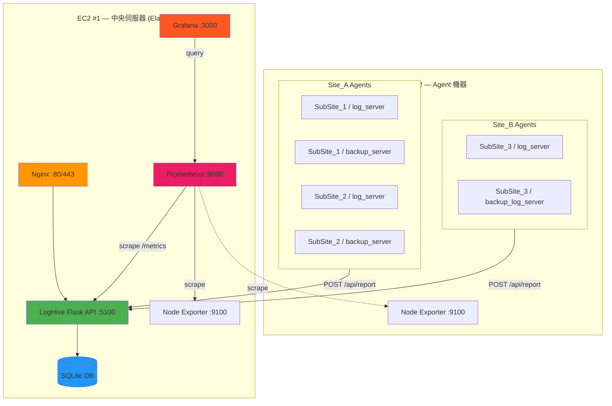
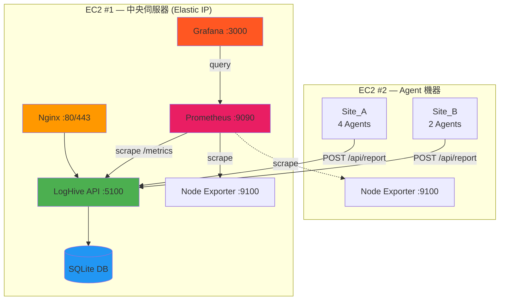

# 部署指南

從本地 Docker 到生產環境兩台 EC2 架構的完整部署指南。

---

## 目錄

- [前置需求](#前置需求)
- [Part 1: Docker 基礎](#part-1-docker-基礎)
- [Part 2: EC2 #1 — 中央伺服器](#part-2-ec2-1--中央伺服器)
- [Part 3: EC2 #2 — Agent 機器](#part-3-ec2-2--agent-機器)
- [Part 4: Agent 設定](#part-4-agent-設定)
- [Part 5: Agent 部署 (非 Docker)](#part-5-agent-部署-非-docker)
- [Part 6: 維運](#part-6-維運)
- [疑難排解](#疑難排解)

---

## 架構總覽



## 架構樣式 B — 兩欄分群



---

## 前置需求

- Docker Engine 20.10+ 和 Docker Compose 2.0+
- 2 台 AWS EC2（Ubuntu 24.04 LTS）
  - EC2 #1: t3.micro（1 vCPU, 1GB RAM）— 中央伺服器，綁定 Elastic IP
  - EC2 #2: t2.micro — Agent 機器
- 安全群組已設定（見下方）

### 安全群組設定

> [!IMPORTANT]
> 限制存取以減少攻擊面。

| EC2 | 連接埠 | 來源 | 用途 |
|-----|--------|------|------|
| #1 | 22 | 僅我的 IP | SSH |
| #1 | 80 | 0.0.0.0/0 | HTTP (Nginx) |
| #1 | 443 | 0.0.0.0/0 | HTTPS (Nginx) |
| #1 | 3000 | 僅我的 IP | Grafana |
| #1 | 5100 | EC2 #2 私有 IP | Agent API |
| #1 | 9090 | —（僅內部） | Prometheus（勿暴露） |
| #2 | 22 | 僅我的 IP | SSH |
| #2 | 9100 | EC2 #1 私有 IP | Node Exporter |

> [!TIP]
> 同一 VPC 內的 EC2 之間使用**私有 IP**，安全性更高且零數據傳輸費用。

---

## Part 1: Docker 基礎

### 環境變數

| 變數 | 說明 | 預設值 |
|------|------|--------|
| `ENVIRONMENT` | 執行環境 | `production` |
| `PORT` | 服務連接埠 | `5100` |
| `SECRET_KEY` | Flask 密鑰 | *必須修改* |
| `API_TOKEN` | API 認證 token | *必須修改* |
| `ADMIN_USERNAME` | 管理員帳號 | `admin` |
| `ADMIN_PASSWORD` | 管理員密碼 | *必須修改* |
| `TEST_USERNAME` | 測試帳號 | `test` |
| `TEST_PASSWORD` | 測試密碼 | *必須修改* |
| `GF_ADMIN_USER` | Grafana 管理員帳號 | `admin` |
| `GF_ADMIN_PASSWORD` | Grafana 管理員密碼 | *必須修改* |

### 設定優先順序

```
1. docker-compose.yml environment   ← 最高優先（覆蓋其他）
2. .env 檔案                        ← 中等優先
3. config.py 預設值                  ← 最低優先（備援）
```

### 資料持久化

Docker Compose 會自動建立以下 volumes：

| Volume | 用途 |
|--------|------|
| `loghive-data` | SQLite 資料庫 |
| `loghive-logs` | 應用程式日誌 |
| `prometheus-data` | Prometheus 時序資料 |
| `grafana-data` | Grafana 設定和儀表板 |

### 本地快速啟動

```bash
cp .env.example .env
nano .env  # 設定 SECRET_KEY, API_TOKEN, 密碼

docker compose up -d        # 建置並啟動
docker compose logs -f       # 查看日誌
docker compose down          # 停止
```

應用：`http://localhost:5100`

---

## Part 2: EC2 #1 — 中央伺服器

### 1. 連接並安裝 Docker

```bash
ssh -i your-key.pem ubuntu@your-ec2-ip
```

```bash
sudo apt update && sudo apt upgrade -y && \
sudo apt install -y docker.io docker-compose-v2 git curl nginx certbot python3-certbot-nginx htop && \
sudo systemctl start docker && \
sudo systemctl enable docker && \
sudo usermod -aG docker ubuntu && \
echo "✅ 安裝完成！請登出後重新登入。"
```

```bash
exit
ssh -i your-key.pem ubuntu@your-ec2-ip
```

### 2. 克隆並設定

```bash
cd ~ && \
git clone https://github.com/mile-chang/logHive.git && \
cd logHive

# 自動產生安全憑證
cp .env.example .env && \
SECRET_KEY=$(python3 -c "import secrets; print(secrets.token_hex(32))") && \
API_TOKEN=$(python3 -c "import secrets; print(secrets.token_hex(32))") && \
sed -i "s/your-secret-key-here-change-me/$SECRET_KEY/" .env && \
sed -i "s/your-api-token-here-change-me/$API_TOKEN/" .env && \
ADMIN_PASS=$(python3 -c "import secrets; print(secrets.token_urlsafe(16))") && \
sed -i "s/change-me-in-production/$ADMIN_PASS/" .env && \
echo "✅ 憑證已設定"
```

### 3. 設定 Prometheus

編輯 `monitoring/prometheus.yml`，將 `EC2_2_IP` 替換為 EC2 #2 的**私有 IP**：

```bash
nano monitoring/prometheus.yml
```

```yaml
  - job_name: 'node-exporter-ec2-2'
    static_configs:
      - targets: ['<EC2_2_PRIVATE_IP>:9100']
```

### 4. 啟動所有服務

```bash
docker compose up -d

# 確認所有服務運行中
docker compose ps
```

| 服務 | 網址 | 憑證 |
|------|------|------|
| LogHive | `http://<Elastic-IP>:5100` | 見 `.env` |
| Grafana | `http://<Elastic-IP>:3000` | 在 `.env` 設定 `GF_ADMIN_PASSWORD` |
| Prometheus | `http://localhost:9090` | 僅內部存取 |

> [!CAUTION]
> 首次登入後**務必修改 Grafana 預設密碼**。

### 5. Nginx 反向代理

```bash
sudo tee /etc/nginx/sites-available/loghive > /dev/null <<'EOF'
server {
    listen 80;
    server_name _;

    add_header X-Frame-Options "SAMEORIGIN" always;
    add_header X-Content-Type-Options "nosniff" always;
    add_header X-XSS-Protection "1; mode=block" always;

    client_max_body_size 10M;

    location / {
        proxy_pass http://127.0.0.1:5100;
        proxy_set_header Host $host;
        proxy_set_header X-Real-IP $remote_addr;
        proxy_set_header X-Forwarded-For $proxy_add_x_forwarded_for;
        proxy_set_header X-Forwarded-Proto $scheme;
        proxy_connect_timeout 60s;
        proxy_send_timeout 60s;
        proxy_read_timeout 60s;
    }

    location /static/ {
        proxy_pass http://127.0.0.1:5100/static/;
        proxy_cache_valid 200 1d;
        add_header Cache-Control "public, immutable";
    }
}
EOF

sudo ln -sf /etc/nginx/sites-available/loghive /etc/nginx/sites-enabled/ && \
sudo rm -f /etc/nginx/sites-enabled/default && \
sudo nginx -t && sudo systemctl reload nginx && sudo systemctl enable nginx
```

### 6. 防火牆

```bash
sudo ufw allow 22/tcp && sudo ufw allow 80/tcp && sudo ufw allow 443/tcp && \
sudo ufw --force enable
```

### 7. 啟用 Swap（t3.micro 建議）

```bash
sudo fallocate -l 1G /swapfile && sudo chmod 600 /swapfile && \
sudo mkswap /swapfile && sudo swapon /swapfile && \
echo '/swapfile none swap sw 0 0' | sudo tee -a /etc/fstab && \
echo 'vm.swappiness=10' | sudo tee -a /etc/sysctl.conf && sudo sysctl -p
```

### 8. HTTPS（可選 — 需要網域）

```bash
sudo certbot --nginx -d yourdomain.com
```

### 9. 安全強化

```bash
# Fail2Ban（暴力破解防護）
sudo apt install -y fail2ban && \
sudo cp /etc/fail2ban/jail.conf /etc/fail2ban/jail.local && \
sudo systemctl enable fail2ban && sudo systemctl start fail2ban

# 自動安全更新
sudo apt install -y unattended-upgrades && \
sudo dpkg-reconfigure -plow unattended-upgrades
```

### 驗證 EC2 #1 部署

```bash
docker ps                        # 容器執行中
curl http://localhost:5100       # 應用回應正常
sudo systemctl status nginx      # Nginx 執行中
sudo ufw status                  # 防火牆啟用
```

---

## Part 3: EC2 #2 — Agent 機器

### 1. 安裝 Docker

```bash
sudo apt update && sudo apt install -y docker.io docker-compose-v2 git && \
sudo systemctl start docker && sudo systemctl enable docker && \
sudo usermod -aG docker ubuntu
# 登出後重新登入
```

### 2. 克隆並設定

```bash
cd ~ && git clone https://github.com/mile-chang/logHive.git && cd logHive
```

### 3. 建立 `.env` 檔案

> [!WARNING]
> 不要在終端機使用 `export` — token 會留在 shell 歷史紀錄。請使用 `.env` 檔案。

```bash
cat > .env <<EOF
CENTRAL_SERVER_URL=http://<EC2-1-Elastic-IP>:5100/api/report
API_TOKEN=<與-ec2-1-相同的-token>
FILE_GEN_INTERVAL=86400
REPORT_INTERVAL=3600
EOF
```

### 4. 啟動 Agents

```bash
docker compose -f docker-compose.agent.yml up -d

# 確認 7 個服務運行中（6 agents + node-exporter）
docker compose -f docker-compose.agent.yml ps

# 觀察日誌
docker compose -f docker-compose.agent.yml logs -f
```

---

## Part 4: Agent 設定

### 預設 Agent 容器

| # | SITE | SUB_SITE | SERVER_TYPE | 容器名稱 |
|---|------|----------|-------------|----------|
| 1 | Site_A | SubSite_1 | log_server | agent-a-sub1-log |
| 2 | Site_A | SubSite_1 | backup_server | agent-a-sub1-backup |
| 3 | Site_A | SubSite_2 | log_server | agent-a-sub2-log |
| 4 | Site_A | SubSite_2 | backup_server | agent-a-sub2-backup |
| 5 | Site_B | SubSite_3 | log_server | agent-b-sub3-log |
| 6 | Site_B | SubSite_3 | backup_log_server | agent-b-sub3-backup |

### 環境變數

| 變數 | 預設值 | 說明 |
|------|--------|------|
| `CENTRAL_SERVER_URL` | — | EC2 #1 LogHive API 端點 |
| `API_TOKEN` | — | API 認證 token |
| `SITE` | `Site_A` | 站點名稱 |
| `SUB_SITE` | `SubSite_1` | 子站點名稱 |
| `SERVER_TYPE` | `log_server` | 伺服器類型 |
| `FILE_GEN_INTERVAL` | `86400` | 檔案產生間隔（秒） |
| `REPORT_INTERVAL` | `3600` | 回報間隔（秒） |
| `MAX_SIZE_MB` | `500` | 每個 Agent 最大資料量（MB） |

### 每個 Agent 的運作方式

每個容器執行兩個背景程序：
1. **`file_generator.sh`** — 每隔 `FILE_GEN_INTERVAL` 在 `/data` 建立隨機檔案（1KB–20MB）
2. **`disk_agent.sh`** — 執行 `du -sk /data` 取得真實大小，然後 POST 到 EC2 #1

每個 Agent 都有獨立的 Docker volume。

### Demo 模式

```bash
# 快速間隔 — 啟動容器前在 .env 設定
FILE_GEN_INTERVAL=60     # 每 60 秒產生檔案
REPORT_INTERVAL=30       # 每 30 秒回報
```

### 手動 Demo 觸發

```bash
# 立即產生檔案
./agent/demo_generate.sh        # 每個 Agent 1 個檔案
./agent/demo_generate.sh 5      # 每個 Agent 5 個檔案

# 強制所有 Agent 立即回報
for c in agent-a-sub1-log agent-a-sub1-backup agent-a-sub2-log agent-a-sub2-backup agent-b-sub3-log agent-b-sub3-backup; do
  docker exec $c /opt/agent/disk_agent.sh
done
```

### 清理

```bash
# 僅清除資料（容器繼續執行）
./agent/clean_agent_data.sh

# 停止並移除所有資料
docker compose -f docker-compose.agent.yml down -v
```

### 磁碟空間估算

| 項目 | 大小 |
|------|------|
| EC2 #2 總磁碟 | 8 GB |
| OS + Docker 開銷 | ~3 GB |
| Agent 可用空間 | ~5 GB |
| 每個 Agent 上限 (`MAX_SIZE_MB`) | 500 MB |
| 6 × 500 MB | 3 GB ✅ |

---

## Part 5: Agent 部署 (非 Docker)

在生產伺服器上直接用 cron 部署 Agent：

```bash
# 1. 複製 agent 到遠端伺服器
scp agent/disk_agent.sh user@remote-server:/opt/disk-agent/

# 2. 設定 agent
nano /opt/disk-agent/disk_agent.sh
# 修改：CENTRAL_SERVER_URL, API_TOKEN, SITE, SUB_SITE, SERVER_TYPE

# 3. 設定執行權限並測試
chmod +x /opt/disk-agent/disk_agent.sh
/opt/disk-agent/disk_agent.sh

# 4. 排程 cron（每小時執行）
crontab -e
0 * * * * /opt/disk-agent/disk_agent.sh >> /var/log/disk-agent.log 2>&1
```

若為受限網路環境，使用 `disk_agent_v2.sh`（支援 SSH 通道）。

---

## Part 6: 維運

### 自動備份

```bash
mkdir -p ~/scripts && \
cat > ~/scripts/backup-loghive.sh <<'EOF'
#!/bin/bash
BACKUP_DIR=~/backups
DATE=$(date +%Y%m%d_%H%M%S)
mkdir -p $BACKUP_DIR
docker run --rm -v loghive_loghive-data:/data -v $BACKUP_DIR:/backup \
  alpine tar czf /backup/loghive-data-$DATE.tar.gz -C /data .
cp ~/logHive/.env $BACKUP_DIR/.env-$DATE
find $BACKUP_DIR -name "loghive-data-*.tar.gz" -mtime +7 -delete
find $BACKUP_DIR -name ".env-*" -mtime +7 -delete
echo "[$(date)] 備份完成: loghive-data-$DATE.tar.gz"
EOF

chmod +x ~/scripts/backup-loghive.sh && \
(crontab -l 2>/dev/null; echo "0 2 * * * /home/ubuntu/scripts/backup-loghive.sh >> /home/ubuntu/backup.log 2>&1") | crontab -
```

### 手動備份與還原

```bash
# 備份
docker run --rm \
  -v loghive-data:/data \
  -v $(pwd):/backup \
  alpine tar czf /backup/loghive-data-backup.tar.gz -C /data .

# 還原
docker run --rm \
  -v loghive-data:/data \
  -v $(pwd):/backup \
  alpine tar xzf /backup/loghive-data-backup.tar.gz -C /data
```

### 常用指令

```bash
cd ~/logHive
docker compose ps                # 狀態
docker compose logs -f           # 查看日誌
docker compose logs --tail=100   # 最近日誌
docker compose restart           # 重啟
docker compose down              # 停止
docker compose up -d             # 啟動
docker compose up -d --build     # 重建並啟動
docker compose exec loghive bash # 進入容器
git pull && docker compose up -d --build  # 更新
```

### 更新密碼

```bash
docker compose exec loghive python3 tools/update_passwords.py
```

### Grafana 儀表板

自動預裝的儀表板包含以下面板：

| 面板 | 資料來源 | 說明 |
|------|----------|------|
| CPU 使用率 | Node Exporter | 每台 EC2 的 CPU 使用率 |
| 記憶體使用率 | Node Exporter | RAM 使用 vs 總量 |
| 磁碟使用率 | Node Exporter | 根檔案系統使用百分比 |
| HTTP 請求速率 | Flask Instrumentator | 每秒請求數/端點 |
| Agent 回報總數 | 自訂計數器 | 收到的 Agent 回報總數 |

### 監控端點

| 端點 | 連接埠 | 認證 | 說明 |
|------|--------|------|------|
| `/metrics` | 5100 | 無 | Prometheus Flask 指標 |
| Node Exporter | 9100 | 無 | 系統指標 |
| Prometheus | 9090 | 無 | 指標聚合 |
| Grafana | 3000 | 登入 | 儀表板 UI |

> [!WARNING]
> `/metrics` 沒有認證保護。確保 5100 連接埠僅限受信任的來源存取。

---

## 疑難排解

### EC2 #1

| 問題 | 解決方式 |
|------|----------|
| 容器無法啟動 | `docker compose logs loghive` |
| 記憶體不足 | 啟用 swap，檢查 `free -h` |
| 連接埠衝突 | `lsof -i :5100` 或修改 `.env` 中的 `PORT` |
| Nginx 502 | `docker ps` 後 `sudo systemctl restart nginx` |
| 磁碟已滿 | `docker system prune -a --volumes` |
| 無法連線 | 檢查安全群組 & `sudo ufw status` |
| 健康檢查失敗 | `docker inspect --format='{{.State.Health.Status}}' loghive` |
| 資料庫問題 | `docker compose exec loghive python3 -c "from models import init_db; init_db()"` |

### EC2 #2

```bash
# 測試到 EC2 #1 的連線
curl -X POST http://<Elastic-IP>:5100/api/report \
  -H "Content-Type: application/json" \
  -d '{"token":"<API_TOKEN>","site":"Test","sub_site":"Test","server_type":"test","path":"/data","size_mb":100}'

# 檢查每個 Agent 的磁碟使用量
for c in agent-a-sub1-log agent-a-sub1-backup agent-a-sub2-log agent-a-sub2-backup agent-b-sub3-log agent-b-sub3-backup; do
  echo "$c: $(docker exec $c du -sm /data 2>/dev/null | cut -f1)MB"
done
```

### 緊急復原

```bash
# 從備份還原
cd ~/logHive && docker compose down
docker run --rm -v loghive_loghive-data:/data -v ~/backups:/backup \
  alpine tar xzf /backup/loghive-data-YYYYMMDD_HHMMSS.tar.gz -C /data
docker compose up -d

# 完全重設（最後手段）
docker compose down -v && docker compose up -d
```

---

## 安全檢查清單

- [ ] 修改 `.env` 中的所有預設密碼
- [ ] 首次登入後修改 Grafana 管理員密碼
- [ ] 安全群組限制到最少必要的 IP
- [ ] 不要將 5100/9090 連接埠暴露到網路
- [ ] 啟用 UFW 防火牆
- [ ] 設定 Fail2Ban
- [ ] 啟用自動安全更新
- [ ] 設定自動備份
- [ ] 使用 HTTPS 搭配網域（可選）
